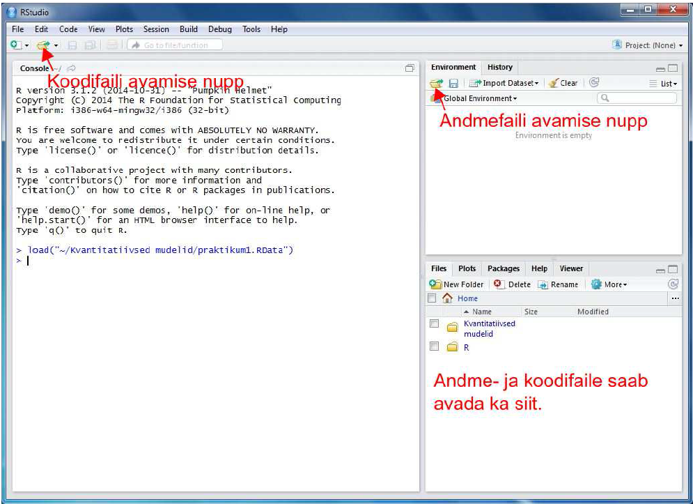

# Kvantitatiivsed mudelid käitumisteadustes (SHPH.00.004). 1. praktikum: RStudio kasutamine, kirjeldav statistika, korrelatsioon, t-test
Martin Kolnes, Dmitri Rozgonjuk, Karin Täht  
8 veebruar 2017  
<script src="hideOutput.js"></script>


#Praktikumi eesmärgid

* RStudio kasutamisega tutvumine: andmete laadimine R'i, andmeväljadele viitamine R'is  
* Üldine kirjeldav statistika: keskmine, mediaan, stadnadrhälve jne  
* Korrelatsiooni kasutamine  
* T-testi kasutamine  

**RStudio paigaldamine**  
Arvutiklassi arvutites on need programmid juba olemas, aga kui on soovi paigaldada RStudio ka enda arvutisse, siis kasutage järgnevaid linke:  

* programmeerimiskeel R -  http://ftp.eenet.ee/pub/cran/  
* RStudio - http://www.rstudio.com/products/rstudio/download/  

# RStudio kasutamine   

Laadige alla praktikumi koodi ja andmeid sisaldav zip-fail Moodle'ist. Pakkige zip-fail lahti. Selles on 2 faili:
koodifail praktikum1.R ja andmefail praktikum1.RData.  

Käivitame RStudio. Avanema peaks allolev pilt.
<div style="width:500px; height=500px">

</div>

Avame zip-failis olnud koodifaili praktikum1.R ja andmefaili prakitkum1.RData kasutades ülaloleval joonisel osutatud nuppe või RStudio aknas paremal all osas paiknevat paneeli *Files*. Kui soovime olemasoleva koodifaili asemel avada hoopis uut tühja koodifaili, siis seda saab teha valides RStudio menüü-ribalt *File* ja sellest *New File* -> *R Script*.

Nüüd peaks meil RStudio aknas lahti olemas 4 osa. Erinevate osade funktsioonid on toodud allpool.
<div style="width:500px; height=500px">

</div>


**Üleval vasakul** olevasse ossa kirjutame koodi, mille abil ütleme R-ile, mida me tahame, et see andmetega teeks. Kuidas koodi R-ile saatmine käib? Kui soovime saata ainult ühte rida korraga tuleb kõige pealt klõpsata sellel koodireal, mida soovime R-ile saata (nii et kursor hakkab vilkuma sellel real) ja seejärel vajutada koodiredaktori paneeli paremal ülaosas paiknevat nuppu *Run*. Nupu asemel võib kasutada ka klahvikombinatsiooni *Ctrl + Enter* (Maci arvutitel *Cmd + Enter*). Kui soovime saata mitut koodirida korraga, tuleb need koodiredaktoris valida (st teha hiirega siniseks) ja seejärel vajutada *Run*-nuppu või klahvikombinatsiooni.

**All vasakul** on konsool (*Console*). Seal asubki arvutusi teostav R ise. Kui laseme R-il midagi arvutada, ilmuvad tulemused nähtavale just selles osas. Koodi võib põhimõtteliselt kirjutada ka otse siia, aga enamasti on mugavam kirjutada kood üleval valmis ja seejärel alla konsooli saata. Nii on lihtsam koodi vajadusel parandusi teha ja koodi korduvkasutada.

**All paremal** asub 5 erinevat paneeli:

* *Files*: R-i koodi ja andmefailide avamiseks.  
* *Plots*: selles osas ilmuvad nähtavale joonised.  
* *Packages*: selle osa abil saab installida ja laadida lisamooduleid, mis lisavad R-ile täiendavat funktsionaalsust. Lisamoodulid tuleb kõigepealt installida, st öelda R-ile, see tõmbaks mooduli internetist antud arvutisse. Seda saab teha vajutades paneelil nuppu *Install* ja kirjutades avanevasse aknasse meid huvitava lisamooduli nime. Kui R on mooduli installinud, tuleb see ka laadida. Laadimiseks tuleb vajaminev moodul *Packages*-paneeli nimekirjast üles otsida ja selle nime eesasuvasse kasti linnukene teha. Lisamooduleid saab installida ja laadida ka R-i koodi abil - *library("lisamooduli nimi")*.    
* *Help*: Abiinfo R-i funktsioonide kohta. Kirjutades paneeli otsingukasti meid huvitava R-i funktsiooni nime ja vajutades Enterit, näidatakse infot funktsiooni kasutamise kohta. Abiinfo lehe lõpus on toodud ka näited selle konkreetse funktsiooni kasutamise kohta.  
* *Viewer*: Selle osa abil saab teha keerulisemat tüüpi andmevisualisatsioone, millel on lisaks joonisele ka kontrollelemendid, mis võimaldavad joonise parameetreid muuta. Seda osa me antud kursusel ei kasuta.  

**Üleval  paremal** asub 2 paneeli:

* *Environment*: selles osas näidatakse parajasti lahti olevaid andmeid.
* *History*: R-i konsooli käskude ajalugu.
Natuke lähemalt *Environment* paneelist. Kui avasite alguses andmefaili *praktikum1.RData*, peaks paneel välja nägema nagu alloleval pildil. Muutuja *tabel* viitab konkreetse andmetabeli nimele. Erinevalt näiteks SPSS-ist võivad R-i andmefailid sisaldada rohkem kui ühte andmetabelit (ja lisaks andmetabelitele ka teistsuguseid andmestruktuure). Igal andmetabelil on oma nimi ja tabelis olevad andmed saamegi hiljem kätte just selle nime abil. 200 obs of 10 variables näitab, et tabelis on 200 rida ja 10 tulpa.

<div style="width:400px; height=400px">

</div>

Klõpsates tabeli nime ees oleval sinisel nupul peaks avanema allolev pilt.
<div style="width:400px; height=400px">

</div>


Meile näidatakse tabelis olevate tulpade nimesid, andmetüüpe ja esimesi andmepunkte. Esimene tulp/muutuja kannab nime "vanus". Andmetüüp on *int* , mis tuleb inglisekeelsest sõnast *integer* ehk täisarv, st. tegemist on tulbaga, milles sisalduvad andmed on täisarvud. (Teine R-is levinud numbriliste andmete tüüp on *num* ehk *numeric*, mis võib sisaldada ka komakohaga arve.) Teine tulp
kannab nime "elukoht"" ja selle tüübiks on märgitud *Factor* w/ 2 levels „maa“ , „linn“. *Factor* tähendab R-i kontekstis kategooriaid sisaldavat muutujat. Antud juhul on neid kategooriaid 2 tükki: „maa“ ja „linn“. Kõik ülej??nud tabelis olevad muutujad sisaldavad sarnaselt esimese tulbaga täisarvulist tüüpi andmeid (*int*).

Samasuguse ülevaate saate ka siis, kui kirjutate kasutate funktsiooni *str* ja lisate argumendiks vastava andmetabeli. Antud juhul:


```r
load("praktikum1.RData")
str(tabel)
```

```
## 'data.frame':	200 obs. of  10 variables:
##  $ vanus        : int  42 52 26 27 18 46 28 60 23 51 ...
##  $ elukoht      : Factor w/ 2 levels "maa","linn": 2 2 1 1 2 1 1 2 1 2 ...
##  $ sotsiaalsus  : int  123 140 97 153 96 138 134 138 100 137 ...
##  $ meelekindlus : int  109 115 96 114 110 94 120 118 97 128 ...
##  $ ekstravertsus: int  118 91 62 123 63 94 68 97 131 126 ...
##  $ neurootilisus: int  123 81 102 58 104 94 69 60 67 103 ...
##  $ avatus       : int  149 161 86 138 144 134 112 133 121 133 ...
##  $ depressioon  : int  8 6 3 3 8 5 7 0 3 8 ...
##  $ traitanx     : int  46 33 47 29 53 39 53 29 27 40 ...
##  $ stateanx     : int  60 39 39 29 52 34 54 29 38 39 ...
```

Klõpsates hiirega andmetabeli nimel, avaneb andmetabel ka visuaalsel kujul.

#Andmetega manipuleerimine

Enne alustamist veenduge, et Teil oleks RStudio töökeskkonnas (*Global Environment*) vastav andmetabel olemas (Joonis 3.).  

R'i üks suurimaid eeliseid SPSS'i ees on võimalus andmeid kiirelt kohandada enda vajadustele.   

Siin tutvustame kolme võimalust:

* Dollari märrgi abil viitamine  
* Nurgelist sulgude kasutamine - R'is annavad nurgelised sulud märku, et mingist objektist/andmestikust tahetakse mingit konkreetsemat muutujat kätte saada.  
* Funktsioon *subset* - See funktsioon võimaldab teha sama, mida nurgelised sulud.   

**Veergude erladamine**  
R'is saab kergesti kasutada funktsioone muutujate peal eraldi. Et arvutada tabelis oleva muutuja kohta statistilisi näitajaid, peame teadma, kuidas tulbas olevad andmed koodi abil kätte saada. Selleks peame teadma nii andmetabeli nime kui ka tulba nime või tulba järjekorranumbrit. Tulbas vanus olevad andmed saame muutuja nime abil kätte nii:  

Dollari märgi abil:   
<div class="fold o">

```r
tabel$vanus
```

```
##   [1] 42 52 26 27 18 46 28 60 23 51 51 66 41 18 18 23 64 36 59 25 44 36 53
##  [24] 48 42 27 50 37 64 42 47 34 55 21 48 49 43 45 51 52 34 42 65 18 38 48
##  [47] 48 41 51 46 37 46 65 32 60 43 31 60 55 61 24 30 64 58 32 50 62 24 23
##  [70] 56 37 36 38 62 32 34 69 20 52 69 47 30 44 69 28 57 24 20 19 60 33 50
##  [93] 39 26 59 57 24 57 62 51 23 42 62 28 24 49 22 69 37 42 51 18 39 52 65
## [116] 49 46 39 30 22 69 41 26 49 42 29 65 51 63 59 58 37 51 51 26 48 26 61
## [139] 50 52 46 34 26 54 35 25 41 36 42 34 24 20 29 23 65 36 34 59 35 35 35
## [162] 49 59 54 25 50 37 58 31 69 49 70 56 64 29 67 58 56 42 47 68 40 33 47
## [185] 59 69 31 31 50 66 63 47 41 65 51 53 70 19 63 60
```
</div>
Nurgeliste sulgudega:
<div class="fold o">

```r
tabel[,1]
```

```
##   [1] 42 52 26 27 18 46 28 60 23 51 51 66 41 18 18 23 64 36 59 25 44 36 53
##  [24] 48 42 27 50 37 64 42 47 34 55 21 48 49 43 45 51 52 34 42 65 18 38 48
##  [47] 48 41 51 46 37 46 65 32 60 43 31 60 55 61 24 30 64 58 32 50 62 24 23
##  [70] 56 37 36 38 62 32 34 69 20 52 69 47 30 44 69 28 57 24 20 19 60 33 50
##  [93] 39 26 59 57 24 57 62 51 23 42 62 28 24 49 22 69 37 42 51 18 39 52 65
## [116] 49 46 39 30 22 69 41 26 49 42 29 65 51 63 59 58 37 51 51 26 48 26 61
## [139] 50 52 46 34 26 54 35 25 41 36 42 34 24 20 29 23 65 36 34 59 35 35 35
## [162] 49 59 54 25 50 37 58 31 69 49 70 56 64 29 67 58 56 42 47 68 40 33 47
## [185] 59 69 31 31 50 66 63 47 41 65 51 53 70 19 63 60
```
</div>
Funktsiooniga *subset*:
<div class="fold o">

```r
subset(tabel, select = vanus) # üks veerg
```

```
##     vanus
## 1      42
## 2      52
## 3      26
## 4      27
## 5      18
## 6      46
## 7      28
## 8      60
## 9      23
## 10     51
## 11     51
## 12     66
## 13     41
## 14     18
## 15     18
## 16     23
## 17     64
## 18     36
## 19     59
## 20     25
## 21     44
## 22     36
## 23     53
## 24     48
## 25     42
## 26     27
## 27     50
## 28     37
## 29     64
## 30     42
## 31     47
## 32     34
## 33     55
## 34     21
## 35     48
## 36     49
## 37     43
## 38     45
## 39     51
## 40     52
## 41     34
## 42     42
## 43     65
## 44     18
## 45     38
## 46     48
## 47     48
## 48     41
## 49     51
## 50     46
## 51     37
## 52     46
## 53     65
## 54     32
## 55     60
## 56     43
## 57     31
## 58     60
## 59     55
## 60     61
## 61     24
## 62     30
## 63     64
## 64     58
## 65     32
## 66     50
## 67     62
## 68     24
## 69     23
## 70     56
## 71     37
## 72     36
## 73     38
## 74     62
## 75     32
## 76     34
## 77     69
## 78     20
## 79     52
## 80     69
## 81     47
## 82     30
## 83     44
## 84     69
## 85     28
## 86     57
## 87     24
## 88     20
## 89     19
## 90     60
## 91     33
## 92     50
## 93     39
## 94     26
## 95     59
## 96     57
## 97     24
## 98     57
## 99     62
## 100    51
## 101    23
## 102    42
## 103    62
## 104    28
## 105    24
## 106    49
## 107    22
## 108    69
## 109    37
## 110    42
## 111    51
## 112    18
## 113    39
## 114    52
## 115    65
## 116    49
## 117    46
## 118    39
## 119    30
## 120    22
## 121    69
## 122    41
## 123    26
## 124    49
## 125    42
## 126    29
## 127    65
## 128    51
## 129    63
## 130    59
## 131    58
## 132    37
## 133    51
## 134    51
## 135    26
## 136    48
## 137    26
## 138    61
## 139    50
## 140    52
## 141    46
## 142    34
## 143    26
## 144    54
## 145    35
## 146    25
## 147    41
## 148    36
## 149    42
## 150    34
## 151    24
## 152    20
## 153    29
## 154    23
## 155    65
## 156    36
## 157    34
## 158    59
## 159    35
## 160    35
## 161    35
## 162    49
## 163    59
## 164    54
## 165    25
## 166    50
## 167    37
## 168    58
## 169    31
## 170    69
## 171    49
## 172    70
## 173    56
## 174    64
## 175    29
## 176    67
## 177    58
## 178    56
## 179    42
## 180    47
## 181    68
## 182    40
## 183    33
## 184    47
## 185    59
## 186    69
## 187    31
## 188    31
## 189    50
## 190    66
## 191    63
## 192    47
## 193    41
## 194    65
## 195    51
## 196    53
## 197    70
## 198    19
## 199    63
## 200    60
```

```r
subset(tabel, select = c(vanus, elukoht)) # kaks veergu. NB! lisasime c() - see näitab, et anname argumendiks vektori. 
```

```
##     vanus elukoht
## 1      42    linn
## 2      52    linn
## 3      26     maa
## 4      27     maa
## 5      18    linn
## 6      46     maa
## 7      28     maa
## 8      60    linn
## 9      23     maa
## 10     51    linn
## 11     51    linn
## 12     66    linn
## 13     41    linn
## 14     18     maa
## 15     18    linn
## 16     23     maa
## 17     64    linn
## 18     36    linn
## 19     59     maa
## 20     25     maa
## 21     44     maa
## 22     36     maa
## 23     53    linn
## 24     48    linn
## 25     42    linn
## 26     27    linn
## 27     50     maa
## 28     37     maa
## 29     64     maa
## 30     42    linn
## 31     47    linn
## 32     34     maa
## 33     55     maa
## 34     21    linn
## 35     48     maa
## 36     49    linn
## 37     43     maa
## 38     45    linn
## 39     51    linn
## 40     52     maa
## 41     34    linn
## 42     42    linn
## 43     65    linn
## 44     18     maa
## 45     38     maa
## 46     48    linn
## 47     48     maa
## 48     41    linn
## 49     51    linn
## 50     46    linn
## 51     37     maa
## 52     46    linn
## 53     65     maa
## 54     32    linn
## 55     60    linn
## 56     43     maa
## 57     31    linn
## 58     60    linn
## 59     55    linn
## 60     61    linn
## 61     24     maa
## 62     30    linn
## 63     64    linn
## 64     58     maa
## 65     32    linn
## 66     50    linn
## 67     62    linn
## 68     24     maa
## 69     23     maa
## 70     56     maa
## 71     37     maa
## 72     36     maa
## 73     38    linn
## 74     62    linn
## 75     32    linn
## 76     34     maa
## 77     69    linn
## 78     20    linn
## 79     52    linn
## 80     69    linn
## 81     47    linn
## 82     30    linn
## 83     44     maa
## 84     69    linn
## 85     28     maa
## 86     57     maa
## 87     24    linn
## 88     20    linn
## 89     19     maa
## 90     60     maa
## 91     33    linn
## 92     50     maa
## 93     39     maa
## 94     26     maa
## 95     59     maa
## 96     57     maa
## 97     24    linn
## 98     57    linn
## 99     62     maa
## 100    51     maa
## 101    23    linn
## 102    42    linn
## 103    62     maa
## 104    28     maa
## 105    24     maa
## 106    49    linn
## 107    22     maa
## 108    69    linn
## 109    37    linn
## 110    42     maa
## 111    51    linn
## 112    18    linn
## 113    39     maa
## 114    52     maa
## 115    65     maa
## 116    49    linn
## 117    46    linn
## 118    39    linn
## 119    30    linn
## 120    22     maa
## 121    69    linn
## 122    41    linn
## 123    26    linn
## 124    49     maa
## 125    42    linn
## 126    29    linn
## 127    65    linn
## 128    51    linn
## 129    63    linn
## 130    59    linn
## 131    58     maa
## 132    37     maa
## 133    51     maa
## 134    51    linn
## 135    26     maa
## 136    48    linn
## 137    26     maa
## 138    61    linn
## 139    50    linn
## 140    52    linn
## 141    46     maa
## 142    34     maa
## 143    26    linn
## 144    54    linn
## 145    35    linn
## 146    25    linn
## 147    41    linn
## 148    36     maa
## 149    42     maa
## 150    34    linn
## 151    24     maa
## 152    20    linn
## 153    29     maa
## 154    23    linn
## 155    65     maa
## 156    36    linn
## 157    34    linn
## 158    59     maa
## 159    35     maa
## 160    35     maa
## 161    35     maa
## 162    49    linn
## 163    59    linn
## 164    54    linn
## 165    25    linn
## 166    50     maa
## 167    37     maa
## 168    58     maa
## 169    31    linn
## 170    69    linn
## 171    49    linn
## 172    70     maa
## 173    56     maa
## 174    64    linn
## 175    29     maa
## 176    67    linn
## 177    58    linn
## 178    56     maa
## 179    42     maa
## 180    47     maa
## 181    68    linn
## 182    40    linn
## 183    33     maa
## 184    47    linn
## 185    59    linn
## 186    69    linn
## 187    31     maa
## 188    31    linn
## 189    50    linn
## 190    66    linn
## 191    63    linn
## 192    47    linn
## 193    41     maa
## 194    65    linn
## 195    51     maa
## 196    53    linn
## 197    70     maa
## 198    19    linn
## 199    63     maa
## 200    60     maa
```
</div>
Kuidas eemaldada veerge?  
Kasutage miinus märki:  
<div class="fold o">

```r
subset(tabel, select = -c(vanus, elukoht))
```

```
##     sotsiaalsus meelekindlus ekstravertsus neurootilisus avatus
## 1           123          109           118           123    149
## 2           140          115            91            81    161
## 3            97           96            62           102     86
## 4           153          114           123            58    138
## 5            96          110            63           104    144
## 6           138           94            94            94    134
## 7           134          120            68            69    112
## 8           138          118            97            60    133
## 9           100           97           131            67    121
## 10          137          128           126           103    133
## 11          133          114           114            56    131
## 12           NA          100           100            85     99
## 13          119          103            67            81     86
## 14          120           98            54            97    118
## 15          136           86           100            71     93
## 16          132          126           131            72    131
## 17          135          121           133            95    151
## 18          100          105           105            57    112
## 19          140          101           144           142    167
## 20          155          132           129           104    157
## 21          153          140            82           105    139
## 22          135          124            96            61    116
## 23          143          136           110            93    131
## 24          117           67            44            72     73
## 25          135          126            90            91    132
## 26          130          127           107           112     88
## 27          127          131           118            63    146
## 28          133           90           124           104    127
## 29          118          132            80            50    110
## 30          142          121            94            48    126
## 31          155          130            97           112    138
## 32          134          114           114            92    134
## 33          132          110            92            51    117
## 34          138          129           116            52    125
## 35          120          143           118           112    141
## 36          126          115           104           104    128
## 37          112           99           114            99    113
## 38          120          117            85           119    122
## 39          140          139           108            55    116
## 40          113          121            53           100     84
## 41           92           70            96           112    106
## 42          141          123           154           101    133
## 43          129          142           100           144    161
## 44          116          104            87            71     97
## 45          152          167            83           127    157
## 46          134          108           120            98    134
## 47          134           99           109           100    126
## 48          136          130           116           101    133
## 49          126          131           102           123     97
## 50          129          126            73            93     93
## 51           98          135           106            84    107
## 52          160          151           140            63    132
## 53          155          129           127            88    110
## 54          123           53           125            95    114
## 55          112          115            95            74    126
## 56          127          134            89            76    119
## 57          140          138           123            97    150
## 58          123          118           168            79    163
## 59          165          157           152            62    142
## 60          142          134           126           101    147
## 61          124          108           105            69    101
## 62          142          112           107            98    173
## 63          124          133           122            71    134
## 64          157          124           121           129    172
## 65          121          141            89           134    154
## 66          130          109           147            64     90
## 67          141          157           146            99    143
## 68          133          141           105           109    152
## 69          112           93            78            98     87
## 70          124          112            72           115    133
## 71          130           80           130           102    120
## 72          131           89            93            50    111
## 73          111          108            92            85    142
## 74          135          116           136            70    144
## 75          126           78           112            83    132
## 76          124          127           114            51    130
## 77          135          125            90            79    101
## 78          118          135            39            81    122
## 79          117          126           139            47    128
## 80          136           97           116            50    110
## 81          115          102           103            86    118
## 82          122           88           118           114    118
## 83          121          104            84            98    111
## 84          124          129           113           110    127
## 85          106          131           127            52    135
## 86          135          138           108            63    115
## 87           85           62            90           131     96
## 88          124          114           100           110    129
## 89          135          114           107            70    121
## 90           86           93            93            74    126
## 91          135          122           118           103    136
## 92          131          140           135            60    118
## 93          126          122           120           120    143
## 94          133          106            66            70    108
## 95          110           84           114           102    116
## 96          107          126            50            34     73
## 97          153          128            87           119    147
## 98          131           78           119           115    152
## 99          138           96           141            51    138
## 100         108          141            93           103    143
## 101         150          178           150           100    158
## 102         159          170           151            75    151
## 103         120          106            82            83     75
## 104         137          126           144            64    108
## 105         125          116            83            83    111
## 106         124           NA            67            62    101
## 107         103           75            91           127    145
## 108         110          120           114           108    119
## 109         133          107            95           100    116
## 110         129           93           101            74    129
## 111         129          112           105           105    123
## 112         128           88           103           107    115
## 113         121          129            88           100    123
## 114         162          152           163           104    164
## 115         110          113            61            54    149
## 116         123          119            96            70    118
## 117         113          106            92           100     74
## 118         136          122           119           105    139
## 119         145          119           149            42    142
## 120         101           99           107           116    132
## 121         147          119           102            81    142
## 122         150          125           116           123    149
## 123         119           78            95            98    102
## 124         128          116            87           108    136
## 125         138          120            79            54     90
## 126         126          124           107            85    132
## 127         153          109           133            96    132
## 128         122          102            89            61    115
## 129          97           84             8           109    124
## 130         129           93            78            90    126
## 131         119           91            94            94    116
## 132          74          100            61            87     89
## 133         122          100           116            76    107
## 134         145          111            91            62    119
## 135         111          119            74            84    131
## 136         132          108           125            46    113
## 137         116          108           110            76    125
## 138         158          111           147            47    132
## 139         132          104           105            74    131
## 140          97           81           100           103    121
## 141         122          130            99            59    100
## 142         126          126            92            72    110
## 143         145           87           136            68    116
## 144         153          132           115           114    137
## 145         114           87           106            70    131
## 146         119          107            81            60    130
## 147          97           90           102           106    109
## 148         106           93            54            95    110
## 149         118           86           117            94    104
## 150         143          118            38            68     90
## 151         131          134           112           111    128
## 152         124           97           113           130    122
## 153         107          113            55           116    110
## 154         159          136           117            93    124
## 155         108           97           118           128    113
## 156         138          176           127            98    118
## 157         122           95            97            77    103
## 158          98          114            91            96    131
## 159         140          141           126            84    108
## 160         112           90            87            77    143
## 161          99           64            72            81     96
## 162         151           73           147            93    156
## 163         130           88            63            92    131
## 164         132           NA           114            76    115
## 165         136          111           124            82    104
## 166         129          112           112            98    133
## 167         118          118            76            84     94
## 168         157          123           143           134    152
## 169         134          152           126           142    110
## 170         118          102           105            80    139
## 171         147          115           146            90    147
## 172         125           95           113            61    100
## 173          82           88            81            89    126
## 174         112          102            83           105    125
## 175         112          125           116            87    116
## 176          99          137           106            65    129
## 177         109           83           104            84    102
## 178         109           58            99            55    110
## 179          77          104            98           125     96
## 180         167          155           107            91    136
## 181         124          116            32            98    121
## 182         149          147           150           102    159
## 183         107          121            72            78    107
## 184         103          103           121            66    135
## 185         104          106            64           114    101
## 186         100          103           121           152    158
## 187         109           94            67           102    105
## 188         122          108            63            79    117
## 189         125           74            95            79    109
## 190         136           78           101            77    136
## 191         127          108           108            35     86
## 192         124          110            88            68    111
## 193         107          127            67            60     98
## 194         128          102            96            56     99
## 195         138          150           114           128    142
## 196         114          147           129           104    148
## 197         108          108            79            73     98
## 198         135          112           103           110    143
## 199          90          143            69           101     75
## 200         151          132           115            59    142
##     depressioon traitanx stateanx
## 1             8       46       60
## 2             6       33       39
## 3             3       47       39
## 4             3       29       29
## 5             8       53       52
## 6             5       39       34
## 7             7       53       54
## 8             0       29       29
## 9             3       27       38
## 10            8       40       39
## 11            0       23       32
## 12            2       34       42
## 13            4       36       39
## 14            5       36       36
## 15            6       44       56
## 16            7       39       44
## 17            6       29       34
## 18            0       28       36
## 19           19       51       53
## 20           13       46       48
## 21            1       33       33
## 22            1       28       34
## 23            0       31       26
## 24           18       57       53
## 25            8       35       37
## 26           18       37       59
## 27            3       33       31
## 28            5       42       40
## 29            3       37       27
## 30            2       32       27
## 31           14       36       55
## 32            7       38       42
## 33            3       31       32
## 34            4       27       24
## 35           27       60       68
## 36            6       44       45
## 37            9       38       46
## 38            8       61       28
## 39            0       25       29
## 40           17       64       61
## 41            6       46       53
## 42            4       29       27
## 43            6       40       42
## 44            1       35       28
## 45           15       35       65
## 46            2       35       34
## 47            3       37       39
## 48            2       31       32
## 49           10       51       70
## 50            4       43       34
## 51            9       43       56
## 52            0       25       24
## 53            9       35       34
## 54            2       42       37
## 55            0       29       39
## 56            3       39       43
## 57            6       44       30
## 58            2       30       27
## 59            0       26       32
## 60            8       44       39
## 61            5       33       33
## 62            6       34       23
## 63           10       31       44
## 64           11       36       26
## 65            0       50       36
## 66            2       32       27
## 67            4       31       23
## 68            5       40       31
## 69           13       48       46
## 70            5       45       56
## 71           21       39       63
## 72            3       28       23
## 73           24       51       55
## 74            8       35       61
## 75            4       45       28
## 76            3       32       25
## 77           10       34       44
## 78            6       38       40
## 79            0       23       23
## 80            0       25       22
## 81            8       39       67
## 82           14       46       54
## 83            9       44       50
## 84           12       40       51
## 85            1       23       40
## 86            3       24       24
## 87           24       58       58
## 88            8       43       39
## 89            5       29       32
## 90           11       37       47
## 91            8       45       40
## 92            1       29       25
## 93           25       55       50
## 94            5       40       28
## 95           11       47       45
## 96           11       34       27
## 97            8       54       34
## 98           16       56       61
## 99            1       24       22
## 100           5       44       33
## 101           6       30       33
## 102           0       28       54
## 103           7       38       30
## 104           7       31       28
## 105           3       39       41
## 106           6       42       43
## 107           9       58       48
## 108           6       40       32
## 109           4       46       54
## 110           3       35       32
## 111          10       51       27
## 112           6       42       35
## 113           5       36       33
## 114           1       29       47
## 115           5       51       38
## 116           2       29       41
## 117          10       43       69
## 118          14       43       NA
## 119           0       25       27
## 120           7       41       40
## 121           2       26       21
## 122           2       46       44
## 123           2       54       30
## 124           9       47       53
## 125           8       39       32
## 126           4       37       45
## 127           6       38       36
## 128           6       36       42
## 129          22       68       60
## 130           8       45       44
## 131           9       36       42
## 132           7       35       31
## 133           7       38       66
## 134           4       30       40
## 135           1       39       32
## 136           2       29       39
## 137           5       39       38
## 138           0       33       28
## 139           2       28       26
## 140           6       52       48
## 141           1       23       35
## 142           1       38       27
## 143           2       29       26
## 144          10       42       37
## 145           4       32       36
## 146           8       36       34
## 147          14       58       56
## 148          11       54       36
## 149           3       40       35
## 150           4       37       44
## 151          11       34       34
## 152          22       44       52
## 153           7       53       45
## 154           8       46       38
## 155          13       47       53
## 156           2       30       32
## 157          14       34       40
## 158           3       37       32
## 159           7       34       29
## 160           1       23       51
## 161          17       54       41
## 162          14       44       38
## 163           4       45       50
## 164           2       34       31
## 165          22       52       55
## 166          13       32       55
## 167           7       48       52
## 168           1       40       34
## 169          18       47       37
## 170           2       40       32
## 171           4       31       36
## 172          13       30       34
## 173           3       39       57
## 174          18       60       62
## 175           1       43       43
## 176           0       26       31
## 177          16       37       34
## 178           7       40       32
## 179          23       50       57
## 180           9       31       61
## 181          22       71       48
## 182           6       29       33
## 183           1       30       27
## 184           0       29       33
## 185           8       54       40
## 186          26       71       79
## 187           7       46       50
## 188          10       43       38
## 189          14       45       54
## 190          14       38       39
## 191           0       22       26
## 192           8       42       37
## 193           3       26       26
## 194          10       45       31
## 195           9       44       55
## 196           2       38       43
## 197           3       37       33
## 198           4       39       39
## 199           3       42       40
## 200           5       27       25
```
</div>
**Ridade eraldamine**
Järjekorra numbri abil saab ridasid samamoodi eraldada nagu veerge:
<div class="fold o">

```r
tabel[1,] #esimne rida
```

```
##   vanus elukoht sotsiaalsus meelekindlus ekstravertsus neurootilisus
## 1    42    linn         123          109           118           123
##   avatus depressioon traitanx stateanx
## 1    149           8       46       60
```
</div>

<div class="fold o">

```r
tabel[1:5,] #esimesed viis rida
```

```
##   vanus elukoht sotsiaalsus meelekindlus ekstravertsus neurootilisus
## 1    42    linn         123          109           118           123
## 2    52    linn         140          115            91            81
## 3    26     maa          97           96            62           102
## 4    27     maa         153          114           123            58
## 5    18    linn          96          110            63           104
##   avatus depressioon traitanx stateanx
## 1    149           8       46       60
## 2    161           6       33       39
## 3     86           3       47       39
## 4    138           3       29       29
## 5    144           8       53       52
```
</div>
Kuidas valida ridu, mis vastavad teatud tingimustele. Proovime näiteks võtta andmestikust need read, kus vaadeldava isiku vanus on alla 30.
Nurgeliste sulgudega:
<div class="fold o">

```r
tabel[tabel$vanus<30,]
```

```
##     vanus elukoht sotsiaalsus meelekindlus ekstravertsus neurootilisus
## 3      26     maa          97           96            62           102
## 4      27     maa         153          114           123            58
## 5      18    linn          96          110            63           104
## 7      28     maa         134          120            68            69
## 9      23     maa         100           97           131            67
## 14     18     maa         120           98            54            97
## 15     18    linn         136           86           100            71
## 16     23     maa         132          126           131            72
## 20     25     maa         155          132           129           104
## 26     27    linn         130          127           107           112
## 34     21    linn         138          129           116            52
## 44     18     maa         116          104            87            71
## 61     24     maa         124          108           105            69
## 68     24     maa         133          141           105           109
## 69     23     maa         112           93            78            98
## 78     20    linn         118          135            39            81
## 85     28     maa         106          131           127            52
## 87     24    linn          85           62            90           131
## 88     20    linn         124          114           100           110
## 89     19     maa         135          114           107            70
## 94     26     maa         133          106            66            70
## 97     24    linn         153          128            87           119
## 101    23    linn         150          178           150           100
## 104    28     maa         137          126           144            64
## 105    24     maa         125          116            83            83
## 107    22     maa         103           75            91           127
## 112    18    linn         128           88           103           107
## 120    22     maa         101           99           107           116
## 123    26    linn         119           78            95            98
## 126    29    linn         126          124           107            85
## 135    26     maa         111          119            74            84
## 137    26     maa         116          108           110            76
## 143    26    linn         145           87           136            68
## 146    25    linn         119          107            81            60
## 151    24     maa         131          134           112           111
## 152    20    linn         124           97           113           130
## 153    29     maa         107          113            55           116
## 154    23    linn         159          136           117            93
## 165    25    linn         136          111           124            82
## 175    29     maa         112          125           116            87
## 198    19    linn         135          112           103           110
##     avatus depressioon traitanx stateanx
## 3       86           3       47       39
## 4      138           3       29       29
## 5      144           8       53       52
## 7      112           7       53       54
## 9      121           3       27       38
## 14     118           5       36       36
## 15      93           6       44       56
## 16     131           7       39       44
## 20     157          13       46       48
## 26      88          18       37       59
## 34     125           4       27       24
## 44      97           1       35       28
## 61     101           5       33       33
## 68     152           5       40       31
## 69      87          13       48       46
## 78     122           6       38       40
## 85     135           1       23       40
## 87      96          24       58       58
## 88     129           8       43       39
## 89     121           5       29       32
## 94     108           5       40       28
## 97     147           8       54       34
## 101    158           6       30       33
## 104    108           7       31       28
## 105    111           3       39       41
## 107    145           9       58       48
## 112    115           6       42       35
## 120    132           7       41       40
## 123    102           2       54       30
## 126    132           4       37       45
## 135    131           1       39       32
## 137    125           5       39       38
## 143    116           2       29       26
## 146    130           8       36       34
## 151    128          11       34       34
## 152    122          22       44       52
## 153    110           7       53       45
## 154    124           8       46       38
## 165    104          22       52       55
## 175    116           1       43       43
## 198    143           4       39       39
```
</div>
Funktsiooniga *subset*:
<div class="fold o">

```r
subset(tabel, vanus < 30)
```

```
##     vanus elukoht sotsiaalsus meelekindlus ekstravertsus neurootilisus
## 3      26     maa          97           96            62           102
## 4      27     maa         153          114           123            58
## 5      18    linn          96          110            63           104
## 7      28     maa         134          120            68            69
## 9      23     maa         100           97           131            67
## 14     18     maa         120           98            54            97
## 15     18    linn         136           86           100            71
## 16     23     maa         132          126           131            72
## 20     25     maa         155          132           129           104
## 26     27    linn         130          127           107           112
## 34     21    linn         138          129           116            52
## 44     18     maa         116          104            87            71
## 61     24     maa         124          108           105            69
## 68     24     maa         133          141           105           109
## 69     23     maa         112           93            78            98
## 78     20    linn         118          135            39            81
## 85     28     maa         106          131           127            52
## 87     24    linn          85           62            90           131
## 88     20    linn         124          114           100           110
## 89     19     maa         135          114           107            70
## 94     26     maa         133          106            66            70
## 97     24    linn         153          128            87           119
## 101    23    linn         150          178           150           100
## 104    28     maa         137          126           144            64
## 105    24     maa         125          116            83            83
## 107    22     maa         103           75            91           127
## 112    18    linn         128           88           103           107
## 120    22     maa         101           99           107           116
## 123    26    linn         119           78            95            98
## 126    29    linn         126          124           107            85
## 135    26     maa         111          119            74            84
## 137    26     maa         116          108           110            76
## 143    26    linn         145           87           136            68
## 146    25    linn         119          107            81            60
## 151    24     maa         131          134           112           111
## 152    20    linn         124           97           113           130
## 153    29     maa         107          113            55           116
## 154    23    linn         159          136           117            93
## 165    25    linn         136          111           124            82
## 175    29     maa         112          125           116            87
## 198    19    linn         135          112           103           110
##     avatus depressioon traitanx stateanx
## 3       86           3       47       39
## 4      138           3       29       29
## 5      144           8       53       52
## 7      112           7       53       54
## 9      121           3       27       38
## 14     118           5       36       36
## 15      93           6       44       56
## 16     131           7       39       44
## 20     157          13       46       48
## 26      88          18       37       59
## 34     125           4       27       24
## 44      97           1       35       28
## 61     101           5       33       33
## 68     152           5       40       31
## 69      87          13       48       46
## 78     122           6       38       40
## 85     135           1       23       40
## 87      96          24       58       58
## 88     129           8       43       39
## 89     121           5       29       32
## 94     108           5       40       28
## 97     147           8       54       34
## 101    158           6       30       33
## 104    108           7       31       28
## 105    111           3       39       41
## 107    145           9       58       48
## 112    115           6       42       35
## 120    132           7       41       40
## 123    102           2       54       30
## 126    132           4       37       45
## 135    131           1       39       32
## 137    125           5       39       38
## 143    116           2       29       26
## 146    130           8       36       34
## 151    128          11       34       34
## 152    122          22       44       52
## 153    110           7       53       45
## 154    124           8       46       38
## 165    104          22       52       55
## 175    116           1       43       43
## 198    143           4       39       39
```
</div>
Sageli on vaja võtta andmetest välja read, mis on ühe muutuja suhtes võrdesed. Näiteks püüame eraldada andmetest kõik read, kus elukoha väärtusega on "maa". Saame kasutada juba tuttavat ridade ja veergude määratlust:  
<div class="fold o">

```r
tabel[tabel$elukoht == "maa",] 
```

```
##     vanus elukoht sotsiaalsus meelekindlus ekstravertsus neurootilisus
## 3      26     maa          97           96            62           102
## 4      27     maa         153          114           123            58
## 6      46     maa         138           94            94            94
## 7      28     maa         134          120            68            69
## 9      23     maa         100           97           131            67
## 14     18     maa         120           98            54            97
## 16     23     maa         132          126           131            72
## 19     59     maa         140          101           144           142
## 20     25     maa         155          132           129           104
## 21     44     maa         153          140            82           105
## 22     36     maa         135          124            96            61
## 27     50     maa         127          131           118            63
## 28     37     maa         133           90           124           104
## 29     64     maa         118          132            80            50
## 32     34     maa         134          114           114            92
## 33     55     maa         132          110            92            51
## 35     48     maa         120          143           118           112
## 37     43     maa         112           99           114            99
## 40     52     maa         113          121            53           100
## 44     18     maa         116          104            87            71
## 45     38     maa         152          167            83           127
## 47     48     maa         134           99           109           100
## 51     37     maa          98          135           106            84
## 53     65     maa         155          129           127            88
## 56     43     maa         127          134            89            76
## 61     24     maa         124          108           105            69
## 64     58     maa         157          124           121           129
## 68     24     maa         133          141           105           109
## 69     23     maa         112           93            78            98
## 70     56     maa         124          112            72           115
## 71     37     maa         130           80           130           102
## 72     36     maa         131           89            93            50
## 76     34     maa         124          127           114            51
## 83     44     maa         121          104            84            98
## 85     28     maa         106          131           127            52
## 86     57     maa         135          138           108            63
## 89     19     maa         135          114           107            70
## 90     60     maa          86           93            93            74
## 92     50     maa         131          140           135            60
## 93     39     maa         126          122           120           120
## 94     26     maa         133          106            66            70
## 95     59     maa         110           84           114           102
## 96     57     maa         107          126            50            34
## 99     62     maa         138           96           141            51
## 100    51     maa         108          141            93           103
## 103    62     maa         120          106            82            83
## 104    28     maa         137          126           144            64
## 105    24     maa         125          116            83            83
## 107    22     maa         103           75            91           127
## 110    42     maa         129           93           101            74
## 113    39     maa         121          129            88           100
## 114    52     maa         162          152           163           104
## 115    65     maa         110          113            61            54
## 120    22     maa         101           99           107           116
## 124    49     maa         128          116            87           108
## 131    58     maa         119           91            94            94
## 132    37     maa          74          100            61            87
## 133    51     maa         122          100           116            76
## 135    26     maa         111          119            74            84
## 137    26     maa         116          108           110            76
## 141    46     maa         122          130            99            59
## 142    34     maa         126          126            92            72
## 148    36     maa         106           93            54            95
## 149    42     maa         118           86           117            94
## 151    24     maa         131          134           112           111
## 153    29     maa         107          113            55           116
## 155    65     maa         108           97           118           128
## 158    59     maa          98          114            91            96
## 159    35     maa         140          141           126            84
## 160    35     maa         112           90            87            77
## 161    35     maa          99           64            72            81
## 166    50     maa         129          112           112            98
## 167    37     maa         118          118            76            84
## 168    58     maa         157          123           143           134
## 172    70     maa         125           95           113            61
## 173    56     maa          82           88            81            89
## 175    29     maa         112          125           116            87
## 178    56     maa         109           58            99            55
## 179    42     maa          77          104            98           125
## 180    47     maa         167          155           107            91
## 183    33     maa         107          121            72            78
## 187    31     maa         109           94            67           102
## 193    41     maa         107          127            67            60
## 195    51     maa         138          150           114           128
## 197    70     maa         108          108            79            73
## 199    63     maa          90          143            69           101
## 200    60     maa         151          132           115            59
##     avatus depressioon traitanx stateanx
## 3       86           3       47       39
## 4      138           3       29       29
## 6      134           5       39       34
## 7      112           7       53       54
## 9      121           3       27       38
## 14     118           5       36       36
## 16     131           7       39       44
## 19     167          19       51       53
## 20     157          13       46       48
## 21     139           1       33       33
## 22     116           1       28       34
## 27     146           3       33       31
## 28     127           5       42       40
## 29     110           3       37       27
## 32     134           7       38       42
## 33     117           3       31       32
## 35     141          27       60       68
## 37     113           9       38       46
## 40      84          17       64       61
## 44      97           1       35       28
## 45     157          15       35       65
## 47     126           3       37       39
## 51     107           9       43       56
## 53     110           9       35       34
## 56     119           3       39       43
## 61     101           5       33       33
## 64     172          11       36       26
## 68     152           5       40       31
## 69      87          13       48       46
## 70     133           5       45       56
## 71     120          21       39       63
## 72     111           3       28       23
## 76     130           3       32       25
## 83     111           9       44       50
## 85     135           1       23       40
## 86     115           3       24       24
## 89     121           5       29       32
## 90     126          11       37       47
## 92     118           1       29       25
## 93     143          25       55       50
## 94     108           5       40       28
## 95     116          11       47       45
## 96      73          11       34       27
## 99     138           1       24       22
## 100    143           5       44       33
## 103     75           7       38       30
## 104    108           7       31       28
## 105    111           3       39       41
## 107    145           9       58       48
## 110    129           3       35       32
## 113    123           5       36       33
## 114    164           1       29       47
## 115    149           5       51       38
## 120    132           7       41       40
## 124    136           9       47       53
## 131    116           9       36       42
## 132     89           7       35       31
## 133    107           7       38       66
## 135    131           1       39       32
## 137    125           5       39       38
## 141    100           1       23       35
## 142    110           1       38       27
## 148    110          11       54       36
## 149    104           3       40       35
## 151    128          11       34       34
## 153    110           7       53       45
## 155    113          13       47       53
## 158    131           3       37       32
## 159    108           7       34       29
## 160    143           1       23       51
## 161     96          17       54       41
## 166    133          13       32       55
## 167     94           7       48       52
## 168    152           1       40       34
## 172    100          13       30       34
## 173    126           3       39       57
## 175    116           1       43       43
## 178    110           7       40       32
## 179     96          23       50       57
## 180    136           9       31       61
## 183    107           1       30       27
## 187    105           7       46       50
## 193     98           3       26       26
## 195    142           9       44       55
## 197     98           3       37       33
## 199     75           3       42       40
## 200    142           5       27       25
```
</div>
Samasuguse tulemuse saame ka funktsiooniga *subset*  
<div class="fold o">

```r
subset(tabel, elukoht == "maa")
```

```
##     vanus elukoht sotsiaalsus meelekindlus ekstravertsus neurootilisus
## 3      26     maa          97           96            62           102
## 4      27     maa         153          114           123            58
## 6      46     maa         138           94            94            94
## 7      28     maa         134          120            68            69
## 9      23     maa         100           97           131            67
## 14     18     maa         120           98            54            97
## 16     23     maa         132          126           131            72
## 19     59     maa         140          101           144           142
## 20     25     maa         155          132           129           104
## 21     44     maa         153          140            82           105
## 22     36     maa         135          124            96            61
## 27     50     maa         127          131           118            63
## 28     37     maa         133           90           124           104
## 29     64     maa         118          132            80            50
## 32     34     maa         134          114           114            92
## 33     55     maa         132          110            92            51
## 35     48     maa         120          143           118           112
## 37     43     maa         112           99           114            99
## 40     52     maa         113          121            53           100
## 44     18     maa         116          104            87            71
## 45     38     maa         152          167            83           127
## 47     48     maa         134           99           109           100
## 51     37     maa          98          135           106            84
## 53     65     maa         155          129           127            88
## 56     43     maa         127          134            89            76
## 61     24     maa         124          108           105            69
## 64     58     maa         157          124           121           129
## 68     24     maa         133          141           105           109
## 69     23     maa         112           93            78            98
## 70     56     maa         124          112            72           115
## 71     37     maa         130           80           130           102
## 72     36     maa         131           89            93            50
## 76     34     maa         124          127           114            51
## 83     44     maa         121          104            84            98
## 85     28     maa         106          131           127            52
## 86     57     maa         135          138           108            63
## 89     19     maa         135          114           107            70
## 90     60     maa          86           93            93            74
## 92     50     maa         131          140           135            60
## 93     39     maa         126          122           120           120
## 94     26     maa         133          106            66            70
## 95     59     maa         110           84           114           102
## 96     57     maa         107          126            50            34
## 99     62     maa         138           96           141            51
## 100    51     maa         108          141            93           103
## 103    62     maa         120          106            82            83
## 104    28     maa         137          126           144            64
## 105    24     maa         125          116            83            83
## 107    22     maa         103           75            91           127
## 110    42     maa         129           93           101            74
## 113    39     maa         121          129            88           100
## 114    52     maa         162          152           163           104
## 115    65     maa         110          113            61            54
## 120    22     maa         101           99           107           116
## 124    49     maa         128          116            87           108
## 131    58     maa         119           91            94            94
## 132    37     maa          74          100            61            87
## 133    51     maa         122          100           116            76
## 135    26     maa         111          119            74            84
## 137    26     maa         116          108           110            76
## 141    46     maa         122          130            99            59
## 142    34     maa         126          126            92            72
## 148    36     maa         106           93            54            95
## 149    42     maa         118           86           117            94
## 151    24     maa         131          134           112           111
## 153    29     maa         107          113            55           116
## 155    65     maa         108           97           118           128
## 158    59     maa          98          114            91            96
## 159    35     maa         140          141           126            84
## 160    35     maa         112           90            87            77
## 161    35     maa          99           64            72            81
## 166    50     maa         129          112           112            98
## 167    37     maa         118          118            76            84
## 168    58     maa         157          123           143           134
## 172    70     maa         125           95           113            61
## 173    56     maa          82           88            81            89
## 175    29     maa         112          125           116            87
## 178    56     maa         109           58            99            55
## 179    42     maa          77          104            98           125
## 180    47     maa         167          155           107            91
## 183    33     maa         107          121            72            78
## 187    31     maa         109           94            67           102
## 193    41     maa         107          127            67            60
## 195    51     maa         138          150           114           128
## 197    70     maa         108          108            79            73
## 199    63     maa          90          143            69           101
## 200    60     maa         151          132           115            59
##     avatus depressioon traitanx stateanx
## 3       86           3       47       39
## 4      138           3       29       29
## 6      134           5       39       34
## 7      112           7       53       54
## 9      121           3       27       38
## 14     118           5       36       36
## 16     131           7       39       44
## 19     167          19       51       53
## 20     157          13       46       48
## 21     139           1       33       33
## 22     116           1       28       34
## 27     146           3       33       31
## 28     127           5       42       40
## 29     110           3       37       27
## 32     134           7       38       42
## 33     117           3       31       32
## 35     141          27       60       68
## 37     113           9       38       46
## 40      84          17       64       61
## 44      97           1       35       28
## 45     157          15       35       65
## 47     126           3       37       39
## 51     107           9       43       56
## 53     110           9       35       34
## 56     119           3       39       43
## 61     101           5       33       33
## 64     172          11       36       26
## 68     152           5       40       31
## 69      87          13       48       46
## 70     133           5       45       56
## 71     120          21       39       63
## 72     111           3       28       23
## 76     130           3       32       25
## 83     111           9       44       50
## 85     135           1       23       40
## 86     115           3       24       24
## 89     121           5       29       32
## 90     126          11       37       47
## 92     118           1       29       25
## 93     143          25       55       50
## 94     108           5       40       28
## 95     116          11       47       45
## 96      73          11       34       27
## 99     138           1       24       22
## 100    143           5       44       33
## 103     75           7       38       30
## 104    108           7       31       28
## 105    111           3       39       41
## 107    145           9       58       48
## 110    129           3       35       32
## 113    123           5       36       33
## 114    164           1       29       47
## 115    149           5       51       38
## 120    132           7       41       40
## 124    136           9       47       53
## 131    116           9       36       42
## 132     89           7       35       31
## 133    107           7       38       66
## 135    131           1       39       32
## 137    125           5       39       38
## 141    100           1       23       35
## 142    110           1       38       27
## 148    110          11       54       36
## 149    104           3       40       35
## 151    128          11       34       34
## 153    110           7       53       45
## 155    113          13       47       53
## 158    131           3       37       32
## 159    108           7       34       29
## 160    143           1       23       51
## 161     96          17       54       41
## 166    133          13       32       55
## 167     94           7       48       52
## 168    152           1       40       34
## 172    100          13       30       34
## 173    126           3       39       57
## 175    116           1       43       43
## 178    110           7       40       32
## 179     96          23       50       57
## 180    136           9       31       61
## 183    107           1       30       27
## 187    105           7       46       50
## 193     98           3       26       26
## 195    142           9       44       55
## 197     98           3       37       33
## 199     75           3       42       40
## 200    142           5       27       25
```
</div>
#Kirjeldav Statistika
Nüüd, kui teame, kuidas anda R'ile edasi ainult üks muutuja andmestikus, proovime saada selgemat ülevaadet muutujast *vanus*.  
**Kekmise** vanuse saame andes funktsioonile *mean* argumendiks muutuja *vanus*:
<div class="fold o">

```r
mean(tabel$vanus)
```

```
## [1] 44.19
```
</div>
**Mediaani** saame funktsiooni *median* abil
<div class="fold o">

```r
median(tabel$vanus)
```

```
## [1] 46
```
</div>
**Standardhälve**
<div class="fold o">

```r
sd(tabel$vanus)
```

```
## [1] 14.61478
```
</div>
**Miinimum** ja **maksimum**
<div class="fold o">

```r
min(tabel$vanus)
```

```
## [1] 18
```

```r
max(tabel$vanus)
```

```
## [1] 70
```
</div>
**Puuduvad väärtused**  
Kui tulbas esineb puuduvaid väärtusi, annab R meile statistiku väärtuseks samuti puuduva väärtuse ehk NA (*not available*):
<div class="fold o">

```r
mean(tabel$sotsiaalsus)
```

```
## [1] NA
```
</div>
Selleks, et puuduvad väärtused arvutustest välja jätta tuleb kirjeldava statistika funktsioonidele ette anda täiendav argument na.rm=TRUE
<div class="fold o">

```r
mean(tabel$sotsiaalsus, na.rm=TRUE)
```

```
## [1] 126.0201
```

```r
median(tabel$sotsiaalsus, na.rm=TRUE)
```

```
## [1] 126
```
</div>
Kategooriaid sisaldava tunnuse kirjeldamisel on abiks **sagedustabel**:
<div class="fold o">

```r
table(tabel$elukoht)
```

```
## 
##  maa linn 
##   87  113
```
</div>
Protsentuaalse jaotuse saame lisades sagedustabeli ümber funktsiooni *prop.table*:
<div class="fold o">

```r
prop.table(table(tabel$elukoht))
```

```
## 
##   maa  linn 
## 0.435 0.565
```
</div>

#Korrelatsioon  
Kahe muutuja vahelise korrelatsioonikordaja väätuse saame andes need muutujad argumentideks funktsioonile *cor*:
<div class="fold o">

```r
cor(tabel$vanus, tabel$depressioon)
```

```
## [1] 0.01107786
```
</div>

Funktsioonile *cor* saab ette anda ka mitu muutujat korraga kasutades andmetabeli tulpade järjekorranumbreid. Sellisel juhul tagastatakse meile korrelatsioonimaatriks.
<div class="fold o">

```r
cor(tabel[,3:7])
```

```
##               sotsiaalsus meelekindlus ekstravertsus neurootilisus
## sotsiaalsus             1           NA            NA            NA
## meelekindlus           NA            1            NA            NA
## ekstravertsus          NA           NA    1.00000000    0.00672297
## neurootilisus          NA           NA    0.00672297    1.00000000
## avatus                 NA           NA    0.46325180    0.28952552
##                  avatus
## sotsiaalsus          NA
## meelekindlus         NA
## ekstravertsus 0.4632518
## neurootilisus 0.2895255
## avatus        1.0000000
```
</div>

Nagu näha on mõnede korrelatsioonikordajate väärtuseks puuduv väärtus ehk NA. Funktsiooni *cor* puhul käib puuduvate väärtuste välja jätmine argumendi *use* abil. *use="complete.obs"* jätab kasvõi ühe puuduva väärtusega inimese andmed välja kõigist arvutustest. *use="pairwise"* jätab inimese välja aga ainult nendest arvutustest, mille puhul tal esineb puuduvaid andmeid:
<div class="fold o">

```r
cor(tabel[,3:7], use="complete.obs")
```

```
##               sotsiaalsus meelekindlus ekstravertsus neurootilisus
## sotsiaalsus    1.00000000   0.44295339  0.4719586343 -0.0648064428
## meelekindlus   0.44295339   1.00000000  0.2512301669  0.0318049429
## ekstravertsus  0.47195863   0.25123017  1.0000000000  0.0002155849
## neurootilisus -0.06480644   0.03180494  0.0002155849  1.0000000000
## avatus         0.42299392   0.30541061  0.4615624091  0.2848434787
##                  avatus
## sotsiaalsus   0.4229939
## meelekindlus  0.3054106
## ekstravertsus 0.4615624
## neurootilisus 0.2848435
## avatus        1.0000000
```
</div>

Kuna antud juhul on puuduvaid andmeid väga vähe, on kahe puuduvate andmete eemaldamise meetodi kasutamise puhul erinevused vaevum?rgatavad:
<div class="fold o">

```r
cor(tabel[,3:7], use="pairwise")
```

```
##               sotsiaalsus meelekindlus ekstravertsus neurootilisus
## sotsiaalsus    1.00000000   0.44295339    0.47088602   -0.06478416
## meelekindlus   0.44295339   1.00000000    0.25133709    0.03217925
## ekstravertsus  0.47088602   0.25133709    1.00000000    0.00672297
## neurootilisus -0.06478416   0.03217925    0.00672297    1.00000000
## avatus         0.42137804   0.30771287    0.46325180    0.28952552
##                  avatus
## sotsiaalsus   0.4213780
## meelekindlus  0.3077129
## ekstravertsus 0.4632518
## neurootilisus 0.2895255
## avatus        1.0000000
```
</div>

Korrelatsioonimaatriksit on enamasti parem jälgida väiksema komakohtade arvu puhul.
Ümardamise saame lisades funktsiooni cor ümber funktsiooni round ja andes sellele ette soovitava komakohtade arvu.
<div class="fold o">

```r
round(cor(tabel[,3:7], use="complete.obs"), 2)
```

```
##               sotsiaalsus meelekindlus ekstravertsus neurootilisus avatus
## sotsiaalsus          1.00         0.44          0.47         -0.06   0.42
## meelekindlus         0.44         1.00          0.25          0.03   0.31
## ekstravertsus        0.47         0.25          1.00          0.00   0.46
## neurootilisus       -0.06         0.03          0.00          1.00   0.28
## avatus               0.42         0.31          0.46          0.28   1.00
```
</div>

Vahel soovime teada ka korrelatsioonikordaja statistilist olulisust. Selle saame funktsiooni cor.test abil.
<div class="fold o">

```r
cor.test(tabel$neurootilisus, tabel$stateanx)
```

```
## 
## 	Pearson's product-moment correlation
## 
## data:  tabel$neurootilisus and tabel$stateanx
## t = 7.7489, df = 197, p-value = 4.808e-13
## alternative hypothesis: true correlation is not equal to 0
## 95 percent confidence interval:
##  0.3690389 0.5832042
## sample estimates:
##       cor 
## 0.4833202
```
</div>

Funktsiooni väljund näeb välja selline:
P-väärtus on väljundis antud kujul 4.809e-13. See tähistab arvu $4.809 \times 10^{-13}$ ehk tegemist on väga väikese arvuga ja seega võib korrelatsioonikordajat lugeda statistiliselt oluliseks. Väga väikeste või väga suurte arvude puhul kasutabki R-i sellist tähistust.

#T-test
T-testi abil saab võrrelda, kas kahe grupi keskmised erinevad statistiliselt olulisel määral. T-testi saab R-is kätte andes funktsioonile t.test ette numbrilise tunnuse (antud juhul vanus) ja grupeeriva tunnuse (antud juhul elukoht) alljärgneval kujul:
<div class="fold o">

```r
t.test(tabel$vanus~tabel$elukoht)
```

```
## 
## 	Welch Two Sample t-test
## 
## data:  tabel$vanus by tabel$elukoht
## t = -1.741, df = 188.74, p-value = 0.08331
## alternative hypothesis: true difference in means is not equal to 0
## 95 percent confidence interval:
##  -7.660306  0.477720
## sample estimates:
##  mean in group maa mean in group linn 
##           42.16092           45.75221
```
</div>

või sellisel kujul:
<div class="fold o">

```r
t.test(vanus~elukoht, data=tabel)
```

```
## 
## 	Welch Two Sample t-test
## 
## data:  vanus by elukoht
## t = -1.741, df = 188.74, p-value = 0.08331
## alternative hypothesis: true difference in means is not equal to 0
## 95 percent confidence interval:
##  -7.660306  0.477720
## sample estimates:
##  mean in group maa mean in group linn 
##           42.16092           45.75221
```
</div>

##Ülesanded

1. Leia avatuse mediaanväärtus (kirjuta kood allolevale reale)

2. Leia sotsiaalsuse standardhälve

3. Leia neurootilisuse keskmine

4. Millises vahemikus varieeruvad ekstravertsuse skoorid?

5. Kas maa- ja linnaelanike keskmised erinevad...

* avatuse osas?
* ekstravertsuse osas?
* sotsiaalsuse osas?
* meelekindluse osas
* neurootilisuse osas?

6. Kui tugev on seisundi- ja püsiärevuse vaheline korrelatsioon?

7. Kui tugev on neurootlisuse ja ekstravertsuse vaheline korrelatsioon?

8. Kui tugev on depressiooni ja püsiärevuse vaheline korrelatsioon?

9. Kas need korrelatsioonikordajad on statistiliselt olulised?


## Mõned huvitavad lingid
Allpool on toodud mõned veebilehed, mis võivad osutuda kasulikuks, kui soovite R-i omal käel natuke lähemalt tundma õppida.

* http://tryr.codeschool.com/ : l?hemat sorti interaktiivne veebikursus R-i põhitõdedest  
* https://www.datacamp.com/courses/introduction-to-r : natuke pikem interaktiivne veebikursus.  
* http://health.adelaide.edu.au/psychology/ccs/docs/lsr/lsr-0.4.pdf : psühholoogiatudengitele suunatud raamat statistikast ja R-ist. Raamatu esimese osa, mis käitleb teile ilmselt juba tuttavaid uurimismeetoditega seotud küimusi võib julgelt vahele jätta ja asuda kohe teise osa kallale.  
* http://statmethods.net/ : lehekülg, kus on kategooriate kaupa ?ra toodud erinevad R-iga seotud teemad.  


