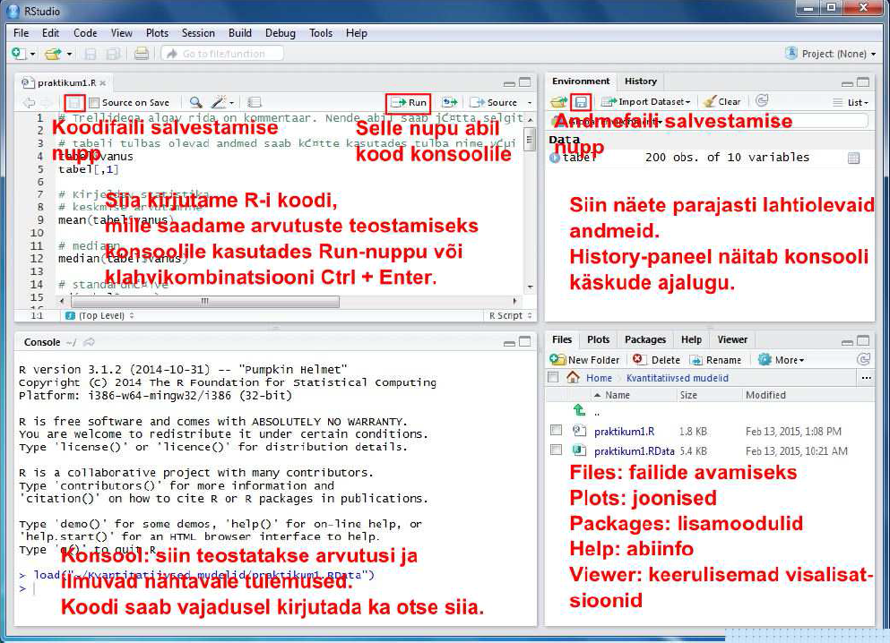
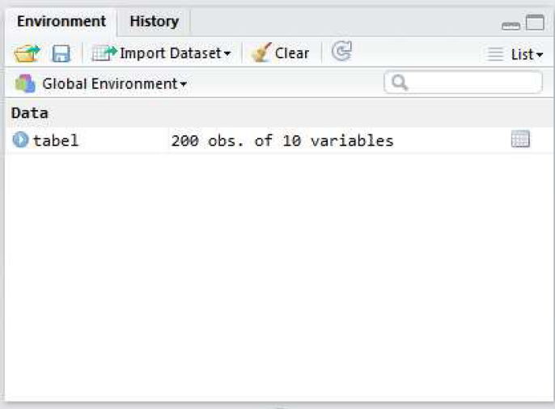
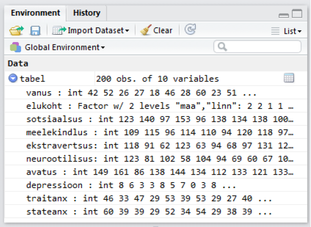

# Kvantitatiivsed mudelid käitumisteadustes (SHPH.00.004). 1. praktikum: RStudio kasutamine, kirjeldav statistika, korrelatsioon, t-test
Martin Kolnes, Dmitri Rozgonjuk, Karin Täht  
8 veebruar 2017  
<script src="hideOutput.js"></script>


#Praktikumi eesmärgid

* RStudio kasutamisega tutvumine: andmete laadimine R'i, andmeväljadele viitamine R'is  
* Üldine kirjeldav statistika: keskmine, mediaan, stadnadrhälve jne  
* Korrelatsiooni kasutamine  
* T-testi kasutamine  

**RStudio paigaldamine**  
Arvutiklassi arvutites on need programmid juba olemas, aga kui on soovi paigaldada RStudio ka enda arvutisse, siis kasutage järgnevaid linke:  

* programmeerimiskeel R -  http://ftp.eenet.ee/pub/cran/  
* RStudio - http://www.rstudio.com/products/rstudio/download/  

# RStudio kasutamine   

Laadige alla praktikumi koodi ja andmeid sisaldav zip-fail Moodle'ist. Pakkige zip-fail lahti. Selles on 2 faili:
koodifail praktikum1.R ja andmefail praktikum1.RData.  

Käivitame RStudio. Avanema peaks allolev pilt.


```r
knitr::include_graphics("_1praktikum/rstudio1.png")
```


Avame zip-failis olnud koodifaili praktikum1.R ja andmefaili prakitkum1.RData kasutades ülaloleval joonisel osutatud nuppe või RStudio aknas paremal all osas paiknevat paneeli *Files*. Kui soovime olemasoleva koodifaili asemel avada hoopis uut tühja koodifaili, siis seda saab teha valides RStudio menüü-ribalt *File* ja sellest *New File* -> *R Script*.

Nüüd peaks meil RStudio aknas lahti olemas 4 osa. Erinevate osade funktsioonid on toodud allpool.



**Üleval vasakul** olevasse ossa kirjutame koodi, mille abil ütleme R-ile, mida me tahame, et see andmetega teeks. Kuidas koodi R-ile saatmine käib? Kui soovime saata ainult ühte rida korraga tuleb kõige pealt klõpsata sellel koodireal, mida soovime R-ile saata (nii et kursor hakkab vilkuma sellel real) ja seejärel vajutada koodiredaktori paneeli paremal ülaosas paiknevat nuppu *Run*. Nupu asemel võib kasutada ka klahvikombinatsiooni *Ctrl + Enter* (Maci arvutitel *Cmd + Enter*). Kui soovime saata mitut koodirida korraga, tuleb need koodiredaktoris valida (st teha hiirega siniseks) ja seejärel vajutada *Run*-nuppu või klahvikombinatsiooni.

**All vasakul** on konsool (*Console*). Seal asubki arvutusi teostav R ise. Kui laseme R-il midagi arvutada, ilmuvad tulemused nähtavale just selles osas. Koodi võib põhimõtteliselt kirjutada ka otse siia, aga enamasti on mugavam kirjutada kood üleval valmis ja seejärel alla konsooli saata. Nii on lihtsam koodi vajadusel parandusi teha ja koodi korduvkasutada.

**All paremal** asub 5 erinevat paneeli:

* *Files*: R-i koodi ja andmefailide avamiseks.  
* *Plots*: selles osas ilmuvad nähtavale joonised.  
* *Packages*: selle osa abil saab installida ja laadida lisamooduleid, mis lisavad R-ile täiendavat funktsionaalsust. Lisamoodulid tuleb kõigepealt installida, st öelda R-ile, see tõmbaks mooduli internetist antud arvutisse. Seda saab teha vajutades paneelil nuppu *Install* ja kirjutades avanevasse aknasse meid huvitava lisamooduli nime. Kui R on mooduli installinud, tuleb see ka laadida. Laadimiseks tuleb vajaminev moodul *Packages*-paneeli nimekirjast üles otsida ja selle nime eesasuvasse kasti linnukene teha. Lisamooduleid saab installida ja laadida ka R-i koodi abil - *library("lisamooduli nimi")*.    
* *Help*: Abiinfo R-i funktsioonide kohta. Kirjutades paneeli otsingukasti meid huvitava R-i funktsiooni nime ja vajutades Enterit, näidatakse infot funktsiooni kasutamise kohta. Abiinfo lehe lõpus on toodud ka näited selle konkreetse funktsiooni kasutamise kohta.  
* *Viewer*: Selle osa abil saab teha keerulisemat tüüpi andmevisualisatsioone, millel on lisaks joonisele ka kontrollelemendid, mis võimaldavad joonise parameetreid muuta. Seda osa me antud kursusel ei kasuta.  

**Üleval  paremal** asub 2 paneeli:

* *Environment*: selles osas näidatakse parajasti lahti olevaid andmeid.
* *History*: R-i konsooli käskude ajalugu.
Natuke lähemalt *Environment* paneelist. Kui avasite alguses andmefaili *praktikum1.RData*, peaks paneel välja nägema nagu alloleval pildil. Muutuja *tabel* viitab konkreetse andmetabeli nimele. Erinevalt näiteks SPSS-ist võivad R-i andmefailid sisaldada rohkem kui ühte andmetabelit (ja lisaks andmetabelitele ka teistsuguseid andmestruktuure). Igal andmetabelil on oma nimi ja tabelis olevad andmed saamegi hiljem kätte just selle nime abil. 200 obs of 10 variables näitab, et tabelis on 200 rida ja 10 tulpa.




Klõpsates tabeli nime ees oleval sinisel nupul peaks avanema allolev pilt.




Meile näidatakse tabelis olevate tulpade nimesid, andmetüüpe ja esimesi andmepunkte. Esimene tulp/muutuja kannab nime "vanus". Andmetüüp on *int* , mis tuleb inglisekeelsest sõnast *integer* ehk täisarv, st. tegemist on tulbaga, milles sisalduvad andmed on täisarvud. (Teine R-is levinud numbriliste andmete tüüp on *num* ehk *numeric*, mis võib sisaldada ka komakohaga arve.) Teine tulp
kannab nime "elukoht"" ja selle tüübiks on märgitud *Factor* w/ 2 levels „maa“ , „linn“. *Factor* tähendab R-i kontekstis kategooriaid sisaldavat muutujat. Antud juhul on neid kategooriaid 2 tükki: „maa“ ja „linn“. Kõik ülej??nud tabelis olevad muutujad sisaldavad sarnaselt esimese tulbaga täisarvulist tüüpi andmeid (*int*).

Samasuguse ülevaate saate ka siis, kui kirjutate kasutate funktsiooni *str* ja lisate argumendiks vastava andmetabeli. Antud juhul:


```r
load("praktikum1.RData")
str(tabel)
```

```
## 'data.frame':	200 obs. of  10 variables:
##  $ vanus        : int  42 52 26 27 18 46 28 60 23 51 ...
##  $ elukoht      : Factor w/ 2 levels "maa","linn": 2 2 1 1 2 1 1 2 1 2 ...
##  $ sotsiaalsus  : int  123 140 97 153 96 138 134 138 100 137 ...
##  $ meelekindlus : int  109 115 96 114 110 94 120 118 97 128 ...
##  $ ekstravertsus: int  118 91 62 123 63 94 68 97 131 126 ...
##  $ neurootilisus: int  123 81 102 58 104 94 69 60 67 103 ...
##  $ avatus       : int  149 161 86 138 144 134 112 133 121 133 ...
##  $ depressioon  : int  8 6 3 3 8 5 7 0 3 8 ...
##  $ traitanx     : int  46 33 47 29 53 39 53 29 27 40 ...
##  $ stateanx     : int  60 39 39 29 52 34 54 29 38 39 ...
```

Klõpsates hiirega andmetabeli nimel, avaneb andmetabel ka visuaalsel kujul.

#Andmetega manipuleerimine

Enne alustamist veenduge, et Teil oleks RStudio töökeskkonnas (*Global Environment*) vastav andmetabel olemas (Joonis 3.).  

R'i üks suurimaid eeliseid SPSS'i ees on võimalus andmeid kiirelt kohandada enda vajadustele.   

Siin tutvustame kolme võimalust:

* Dollari märrgi abil viitamine  
* Nurgelist sulgude kasutamine - R'is annavad nurgelised sulud märku, et mingist objektist/andmestikust tahetakse mingit konkreetsemat muutujat kätte saada.  
* Funktsioon *subset* - See funktsioon võimaldab teha sama, mida nurgelised sulud.   

**Veergude erladamine**  
R'is saab kergesti kasutada funktsioone muutujate peal eraldi. Et arvutada tabelis oleva muutuja kohta statistilisi näitajaid, peame teadma, kuidas tulbas olevad andmed koodi abil kätte saada. Selleks peame teadma nii andmetabeli nime kui ka tulba nime või tulba järjekorranumbrit. Tulbas vanus olevad andmed saame muutuja nime abil kätte nii:  

Dollari märgi abil:   


```r
tabel$vanus
```

```
##   [1] 42 52 26 27 18 46 28 60 23 51 51 66 41 18 18 23 64 36 59 25 44 36 53
##  [24] 48 42 27 50 37 64 42 47 34 55 21 48 49 43 45 51 52 34 42 65 18 38 48
##  [47] 48 41 51 46 37 46 65 32 60 43 31 60 55 61 24 30 64 58 32 50 62 24 23
##  [70] 56 37 36 38 62 32 34 69 20 52 69 47 30 44 69 28 57 24 20 19 60 33 50
##  [93] 39 26 59 57 24 57 62 51 23 42 62 28 24 49 22 69 37 42 51 18 39 52 65
## [116] 49 46 39 30 22 69 41 26 49 42 29 65 51 63 59 58 37 51 51 26 48 26 61
## [139] 50 52 46 34 26 54 35 25 41 36 42 34 24 20 29 23 65 36 34 59 35 35 35
## [162] 49 59 54 25 50 37 58 31 69 49 70 56 64 29 67 58 56 42 47 68 40 33 47
## [185] 59 69 31 31 50 66 63 47 41 65 51 53 70 19 63 60
```

Nurgeliste sulgudega:


```r
tabel[,1]
```

Funktsiooniga *subset*:


```r
subset(tabel, select = vanus) # üks veerg
subset(tabel, select = c(vanus, elukoht)) # kaks veergu. NB! lisasime c() - see näitab, et anname argumendiks vektori. 
```

Kuidas eemaldada veerge?  
Kasutage miinus märki:  


```r
subset(tabel, select = -c(vanus, elukoht))
```

**Ridade eraldamine**
Järjekorra numbri abil saab ridasid samamoodi eraldada nagu veerge:


```r
tabel[1,] #esimne rida
```


```r
tabel[1:5,] #esimesed viis rida
```

Kuidas valida ridu, mis vastavad teatud tingimustele. Proovime näiteks võtta andmestikust need read, kus vaadeldava isiku vanus on alla 30.
Nurgeliste sulgudega:


```r
tabel[tabel$vanus<30,]
```

Funktsiooniga *subset*:


```r
subset(tabel, vanus < 30)
```

Sageli on vaja võtta andmetest välja read, mis on ühe muutuja suhtes võrdesed. Näiteks püüame eraldada andmetest kõik read, kus elukoha väärtusega on "maa". Saame kasutada juba tuttavat ridade ja veergude määratlust:  


```r
tabel[tabel$elukoht == "maa",] 
```

Samasuguse tulemuse saame ka funktsiooniga *subset*  


```r
subset(tabel, elukoht == "maa")
```

#Kirjeldav Statistika
Nüüd, kui teame, kuidas anda R'ile edasi ainult üks muutuja andmestikus, proovime saada selgemat ülevaadet muutujast *vanus*.  
**Kekmise** vanuse saame andes funktsioonile *mean* argumendiks muutuja *vanus*:


```r
mean(tabel$vanus)
```

```
## [1] 44.19
```

**Mediaani** saame funktsiooni *median* abil


```r
median(tabel$vanus)
```

```
## [1] 46
```

**Standardhälve**


```r
sd(tabel$vanus)
```

```
## [1] 14.61478
```

**Miinimum** ja **maksimum**


```r
min(tabel$vanus)
```

```
## [1] 18
```

```r
max(tabel$vanus)
```

```
## [1] 70
```

**Puuduvad väärtused**  
Kui tulbas esineb puuduvaid väärtusi, annab R meile statistiku väärtuseks samuti puuduva väärtuse ehk NA (*not available*):


```r
mean(tabel$sotsiaalsus)
```

```
## [1] NA
```

Selleks, et puuduvad väärtused arvutustest välja jätta tuleb kirjeldava statistika funktsioonidele ette anda täiendav argument na.rm=TRUE


```r
mean(tabel$sotsiaalsus, na.rm=TRUE)
```

```
## [1] 126.0201
```

```r
median(tabel$sotsiaalsus, na.rm=TRUE)
```

```
## [1] 126
```

Kategooriaid sisaldava tunnuse kirjeldamisel on abiks **sagedustabel**:


```r
table(tabel$elukoht)
```

```
## 
##  maa linn 
##   87  113
```

Protsentuaalse jaotuse saame lisades sagedustabeli ümber funktsiooni *prop.table*:


```r
prop.table(table(tabel$elukoht))
```

```
## 
##   maa  linn 
## 0.435 0.565
```


#Korrelatsioon  
Kahe muutuja vahelise korrelatsioonikordaja väätuse saame andes need muutujad argumentideks funktsioonile *cor*:


```r
cor(tabel$vanus, tabel$depressioon)
```

```
## [1] 0.01107786
```


Funktsioonile *cor* saab ette anda ka mitu muutujat korraga kasutades andmetabeli tulpade järjekorranumbreid. Sellisel juhul tagastatakse meile korrelatsioonimaatriks.


```r
cor(tabel[,3:7])
```

```
##               sotsiaalsus meelekindlus ekstravertsus neurootilisus
## sotsiaalsus             1           NA            NA            NA
## meelekindlus           NA            1            NA            NA
## ekstravertsus          NA           NA    1.00000000    0.00672297
## neurootilisus          NA           NA    0.00672297    1.00000000
## avatus                 NA           NA    0.46325180    0.28952552
##                  avatus
## sotsiaalsus          NA
## meelekindlus         NA
## ekstravertsus 0.4632518
## neurootilisus 0.2895255
## avatus        1.0000000
```


Nagu näha on mõnede korrelatsioonikordajate väärtuseks puuduv väärtus ehk NA. Funktsiooni *cor* puhul käib puuduvate väärtuste välja jätmine argumendi *use* abil. *use="complete.obs"* jätab kasvõi ühe puuduva väärtusega inimese andmed välja kõigist arvutustest. *use="pairwise"* jätab inimese välja aga ainult nendest arvutustest, mille puhul tal esineb puuduvaid andmeid:


```r
cor(tabel[,3:7], use="complete.obs")
```

```
##               sotsiaalsus meelekindlus ekstravertsus neurootilisus
## sotsiaalsus    1.00000000   0.44295339  0.4719586343 -0.0648064428
## meelekindlus   0.44295339   1.00000000  0.2512301669  0.0318049429
## ekstravertsus  0.47195863   0.25123017  1.0000000000  0.0002155849
## neurootilisus -0.06480644   0.03180494  0.0002155849  1.0000000000
## avatus         0.42299392   0.30541061  0.4615624091  0.2848434787
##                  avatus
## sotsiaalsus   0.4229939
## meelekindlus  0.3054106
## ekstravertsus 0.4615624
## neurootilisus 0.2848435
## avatus        1.0000000
```


Kuna antud juhul on puuduvaid andmeid väga vähe, on kahe puuduvate andmete eemaldamise meetodi kasutamise puhul erinevused vaevum?rgatavad:


```r
cor(tabel[,3:7], use="pairwise")
```

```
##               sotsiaalsus meelekindlus ekstravertsus neurootilisus
## sotsiaalsus    1.00000000   0.44295339    0.47088602   -0.06478416
## meelekindlus   0.44295339   1.00000000    0.25133709    0.03217925
## ekstravertsus  0.47088602   0.25133709    1.00000000    0.00672297
## neurootilisus -0.06478416   0.03217925    0.00672297    1.00000000
## avatus         0.42137804   0.30771287    0.46325180    0.28952552
##                  avatus
## sotsiaalsus   0.4213780
## meelekindlus  0.3077129
## ekstravertsus 0.4632518
## neurootilisus 0.2895255
## avatus        1.0000000
```


Korrelatsioonimaatriksit on enamasti parem jälgida väiksema komakohtade arvu puhul.
Ümardamise saame lisades funktsiooni cor ümber funktsiooni round ja andes sellele ette soovitava komakohtade arvu.


```r
round(cor(tabel[,3:7], use="complete.obs"), 2)
```

```
##               sotsiaalsus meelekindlus ekstravertsus neurootilisus avatus
## sotsiaalsus          1.00         0.44          0.47         -0.06   0.42
## meelekindlus         0.44         1.00          0.25          0.03   0.31
## ekstravertsus        0.47         0.25          1.00          0.00   0.46
## neurootilisus       -0.06         0.03          0.00          1.00   0.28
## avatus               0.42         0.31          0.46          0.28   1.00
```


Vahel soovime teada ka korrelatsioonikordaja statistilist olulisust. Selle saame funktsiooni cor.test abil.


```r
cor.test(tabel$neurootilisus, tabel$stateanx)
```

```
## 
## 	Pearson's product-moment correlation
## 
## data:  tabel$neurootilisus and tabel$stateanx
## t = 7.7489, df = 197, p-value = 4.808e-13
## alternative hypothesis: true correlation is not equal to 0
## 95 percent confidence interval:
##  0.3690389 0.5832042
## sample estimates:
##       cor 
## 0.4833202
```

Funktsiooni väljund näeb välja selline:
P-väärtus on väljundis antud kujul 4.809e-13. See tähistab arvu $4.809 \times 10^{-13}$ ehk tegemist on väga väikese arvuga ja seega võib korrelatsioonikordajat lugeda statistiliselt oluliseks. Väga väikeste või väga suurte arvude puhul kasutabki R-i sellist tähistust.

#T-test
T-testi abil saab võrrelda, kas kahe grupi keskmised erinevad statistiliselt olulisel määral. T-testi saab R-is kätte andes funktsioonile t.test ette numbrilise tunnuse (antud juhul vanus) ja grupeeriva tunnuse (antud juhul elukoht) alljärgneval kujul:


```r
t.test(tabel$vanus~tabel$elukoht)
```

```
## 
## 	Welch Two Sample t-test
## 
## data:  tabel$vanus by tabel$elukoht
## t = -1.741, df = 188.74, p-value = 0.08331
## alternative hypothesis: true difference in means is not equal to 0
## 95 percent confidence interval:
##  -7.660306  0.477720
## sample estimates:
##  mean in group maa mean in group linn 
##           42.16092           45.75221
```


või sellisel kujul:

```r
t.test(vanus~elukoht, data=tabel)
```

```
## 
## 	Welch Two Sample t-test
## 
## data:  vanus by elukoht
## t = -1.741, df = 188.74, p-value = 0.08331
## alternative hypothesis: true difference in means is not equal to 0
## 95 percent confidence interval:
##  -7.660306  0.477720
## sample estimates:
##  mean in group maa mean in group linn 
##           42.16092           45.75221
```


##Ülesanded

1. Leia avatuse mediaanväärtus (kirjuta kood allolevale reale)

2. Leia sotsiaalsuse standardhälve

3. Leia neurootilisuse keskmine

4. Millises vahemikus varieeruvad ekstravertsuse skoorid?

5. Kas maa- ja linnaelanike keskmised erinevad...

* avatuse osas?
* ekstravertsuse osas?
* sotsiaalsuse osas?
* meelekindluse osas
* neurootilisuse osas?

6. Kui tugev on seisundi- ja püsiärevuse vaheline korrelatsioon?

7. Kui tugev on neurootlisuse ja ekstravertsuse vaheline korrelatsioon?

8. Kui tugev on depressiooni ja püsiärevuse vaheline korrelatsioon?

9. Kas need korrelatsioonikordajad on statistiliselt olulised?


## Mõned huvitavad lingid
Allpool on toodud mõned veebilehed, mis võivad osutuda kasulikuks, kui soovite R-i omal käel natuke lähemalt tundma õppida.

* http://tryr.codeschool.com/ : l?hemat sorti interaktiivne veebikursus R-i põhitõdedest  
* https://www.datacamp.com/courses/introduction-to-r : natuke pikem interaktiivne veebikursus.  
* http://health.adelaide.edu.au/psychology/ccs/docs/lsr/lsr-0.4.pdf : psühholoogiatudengitele suunatud raamat statistikast ja R-ist. Raamatu esimese osa, mis käitleb teile ilmselt juba tuttavaid uurimismeetoditega seotud küimusi võib julgelt vahele jätta ja asuda kohe teise osa kallale.  
* http://statmethods.net/ : lehekülg, kus on kategooriate kaupa ?ra toodud erinevad R-iga seotud teemad.  


