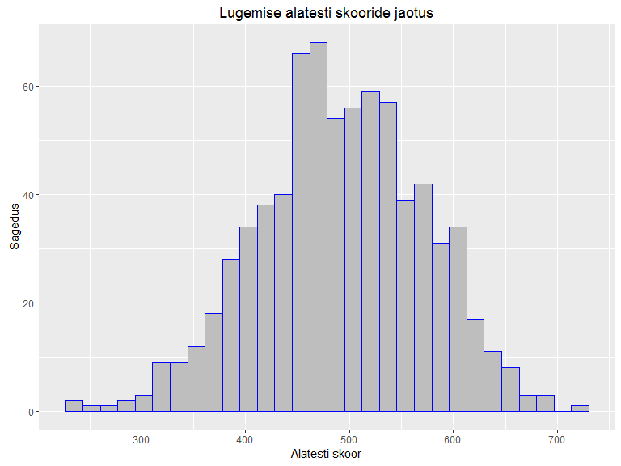
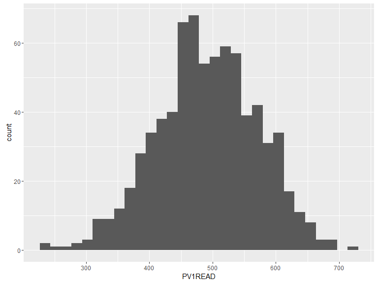

# Kvantitatiivsed mudelid käitumisteadustes (SHPH.00.004). 2. praktikum: Joonised
Martin Kolnes, Dmitri Rozgonjuk, Karin Täht  
28 veebruar 2017  


#Praktikumi eesmärgid

* Andmete lugemine R'i  
    * read.csv ja read.csv2 - csv formaadis failide lugemiseks    
    * read.xlsx - Exceli failide lugemiseks  
    * read.spss - SPSS-i failide lugemiseks  
         
* Eksploratiivsed joonised paketiga ggplot2  
* Ülesanded: eelmise praktikumi teemad; eksploratiivsed joonised  

Laadige alla praktikumi kood ja andmefailid (Kysimustik.csv, Kysimustik.xls ja PISA2009.sav).  

# Andmete sisselugemine Excelist ja SPSS-ist

Eelmises praktikumis olid andmed RData-formaadis olemas. Enamasti jõuavad andmed meieni mõnes teises formaadis. Vaatame, kuidas saada andmed kätte kahest teisest programmist, millega võite kõige tõenäolisemalt kokku puutuda: Excelist ja SPSS-ist.  
  
###Töökausta määratlemine
Alustuseks peaksime rääkima sellisest mõistest nagu R-i töökaust. Kui me RStudio käivitame, määrab R ära kausta, millest ta vaikimisi faile otsima hakkab. Kui tahame salvestada andmeid või jooniseid, siis salvestatakse ka need vaikimisi just sinna kausta. Seda kausta nimetataksegi R-i töökaustaks. Windowsi arvutis on vaikimisi töökaustaks *My Documents*. Andmefailid, mida me laadida tahame, paiknevad tõenäoliselt mõnes muus kaustas või alamkaustas. R-i töökausta muutmiseks peaksime otsima RStudio *Files*-paneeli (akna alumises parempoolses nurgas) abil üles selle kausta, milles meid huvitav andmefail paikneb. Seejärel peaksime muutma selle kausta R-i töökaustaks, vajutades *Files*-paneeli ülaosas asuvat nuppu *More* ja valides avanevast menüüst *Set As Working Directory*.   


## Excel
Andmete Excelist R-i saamiseks on mitu erinevat võimalust. Vaatame kõige tüüpilisemalt kasutatavat
viisi, mis ei eelda lisamooduli kasutamist. Selleks tuleks avada andmed kõigepealt Excelis ja salvestada
need komaga eraldatud csv-formaadis (nimetus tuleb sõnadest *comma separated variable*). Nüüd saame
andmed csv-failist R-i lugeda funktsiooni *read.csv()* abil.  


```r
kysimustik <- read.csv("Kysimustik.csv", header=TRUE) #lisaargumendiga "header" anname teada, et esimesel real on muutujate nimed
```

Koodirida paigutab andmed tabelisse nimega *kysimustik*. Funktsiooni *read.csv()* argument *header=TRUE* ütleb, et csv-faili esimeses reas paiknevad muutujate nimed. Environment-paneelis näeme, et sisseloetud andmestikus on R-i arvates 24 rida ja ainult 1 tulp. Tundub, et midagi on natuke valesti läinud.

Antud juhul on asi selles, et csv-faile on kahte tüüpi: nii-ölda Euroopa ja Ameerika tüüpi. Mandri-Euroopa maades, kasutatakse murdarvude puhul kümnendosa eraldajana koma. Seetõttu ei saa koma csv-failis väljade eraldajana enam kasutada ja selle asemel on kasutusel hoopis semikoolon. Kui meil on eestikeelne Excel, siis tõenäoliselt salvestab see csv-faile just semikoolonitega variandis. Kui klõpsame Environment-paneelis tabeli nime peal ja meile avaneb andmestik, siis on seal tõepoolest näha üsna palju semikooloneid. R-is on 2 csv-failide lugemise funktsiooni:  

1) read.csv - Ameerika tüüpi csv-failide jaoks, milles kümnendkohta eraldab punkt ja andmevälju koma ning
2) read.csv2 - Euroopa tüüpi csv-failide jaoks, milles kümnendkohta eraldab koma ja andmevälju semikoolon. Praegu lähebki meil vaja hoopis funktsiooni read.csv2.

Meie probleemi lahendamiseks on kaks võimalust.  
Esiteks saame kasutada funktsiooni read.csv2(), kus on juba vaikimisi määratud andmevälju eemaldavaks tunnuseks seminkoolon. See on eriti kasulik juhul, kui andmetest eraldab kümnenkohti koma.     

```r
kysimustik <- read.csv2("Kysimustik.csv", header=TRUE) #andmevälju eraldab semikoolon
```
Teiseks saame anda funktsioonile read.csv() lisaargumendiga teada, et meie andmetes eraldab andmevälju semikoolon.

```r
kysimustik <- read.csv("kysimustik.csv", header = TRUE, sep =";") #Argument "sep" võimaldab täpsustada andmeväljade eraldamise viisi toorandmetes.
```


### Uue mooduli installeerimine  
Kui kasutate sageli Excelist pärinevaid andmeid, võib csv-failidega majandamine minna natuke tüütuks. Sellisel juhul on abi lisamooduli *xlsx* funktsioonist *read.xlsx*, mis oskab lugeda Exceli *xls* ja *xlsx* failiformaate otse R-i. Lisamoodul *xlsx* tuleb aga kõigepealt installida.


```r
install.packages("xlsx")
```

Nüüd tuleb natuke oodata kuni R moodulit installib. Seejärel saame lisamooduli laadida. Mooduli laadimine R-is tagab moodulis olevatele funktsioonidele juurdepääsu.  


```r
library(xlsx) #mooduli aktiviseerimine - tagab mooduli funktsioonidele juurdepääsu
```

Seejärel saame funktsiooni *read.xlsx* abil andmestiku sisse lugeda.

```r
kysimustik <- read.xlsx("Kysimustik.xls", sheetIndex=1)
```


Kuna Exceli failides võib olla mitu töölehte, tuleb funktsioonile argumendi *sheetIndex* abil öelda, mitmendat töölehte me sisselugeda soovime. Selle asemel võib kasutada ka argumenti *sheetName* ja töölehe nimetust. Funktsiooni *read.xlsx* puhul on argumendi *header* väärtus juba vaikimisi *TRUE*, nii et seda me praegusel juhul täpsustama ei pea. (Kui me ei taha, et R kohtleks esimese rea andmeid muutujate nimedena, tuleks seda talle öelda *header=FALSE* abil)

##SPSS

SPSS-i andmefaile saab R-i lugeda lisamooduli *foreign* funktsiooni *read.spss* abil. Lisamoodul *foreign* tuleb R-i installatsiooniga kaasa, seetõtuu pole seda vaja eraldi installida. Küll aga peab selle laadima.


```r
library(foreign)
pisa <- read.spss("PISA2009.sav", to.data.frame=TRUE, use.value.labels=FALSE)
```


Funktsiooni *read.spss* sagedamini vajaminevad lisaargumendid on: 

1) *to.data.frame=TRUE* -  ütleb, et soovime andmeid laadida andmetabeli kujul;  

2) *use.value.labels=FALSE* - kasulik, kui meil on SPSS-is Likerti tüüpi andmete puhul määratud iga väärtuse jaoks mingi silt nt 1="täiesti vale". Sellisel juhul ütleb see argument, et soovime andmeid laadida numbrilisel mitte tekstilisel kujul.
  
Lõpetuseks veel töökausta määramisest. Põhimõtteliselt on võimalik jätta ka töökaust määramata ja valida fail interaktiivselt. Seda saab teha kui kirjutada sisselugemiseks kasutatavasse funktsiooni faili nime argumendi väärtuseks file.choose(). Näiteks niimoodi:


```r
pisa <- read.spss(file.choose(), to.data.frame=TRUE, use.value.labels=FALSE)
```

Peaks avanema aken (NB! See ei pruugi olla esiplaanil), mis võimaldab andmefaili valida ja kui me valime praegusel juhul sellesama faili PISA2009.sav, peaks ka lõpptulemus olema sama. On maitse küsimus, kas eelistada töökausta määramist Files-paneeli abil või kasutedes viimati mainitud file.choose() meetodi.

##Kordamine  
Eelmise praktikumi teemade koradamine. Kasutame andmestikku PISA.    

1. Leia uuringus osalenute keskmine vanus?  

```r
mean()# keskmise arvutamiseks sai kasutada funktsiooni mean()
summary()#annab ülevaate tervest andmestikust
```

2. Kui palju tüdrukuid ja poisse oli uuringus? (andmetes: 1 = tüdruk, 2 = poiss)  

```r
table()
```

3. Kui palju õpilasi oli erinevates klassides?  


4. Milline on korrelatsioon matemaatik (PV1MATH), lugemise (PV1READ) ja loodusteaduste (PV1SCIE) alatestide tulemuste vahel?  

```r
cor()
cor.test()
```

5. Võrdle meeste ja naiste keskmisi t-testiga:  

```r
t.test(sõltuv muutuja ~ sõktumatu muutuja)
```

        5.1. lugemine   
        5.2. matemaatika  
        5.3.loodusteadus   
        
6. Millised olid alatestide keskmised väärtused?


# Joonised paketiga ggplot2

Jooniste tegemiseks kasutame paketti *ggplot2*. See on populaarne R'i pakett, mis võimaldab vähese vaevaga teha ilusaid jooniseid. Selles paketis on kaks funktsiooni jooniste tegemiseks: *ggplot()* ja *qplot()*. Meie soovitame kasutada funktsiooni *ggplot()*, sest see on paindlikum ja võimaldab erinevaid andmestikke ühele joonisele lisada.  

Ülevaade paketi võimalustest - http://docs.ggplot2.org/current/ 

Esmalt tutvustame funktsiooni *ggplot()* struktuuri. Nagu kõikide R'i funktsioonide puhul tuleb tutvuda funktsioonile antavate argumentide järjekorra ja sisuga. 

```r
library(ggplot2)# esmalt aktiveerime paketi. NB! pakett peab olema enne installeeritud
ggplot(andmed, aes(x = tunnus1, y = tunnus2)) #See on struktuur, mida saate alati joonise tegemisel kasutada.
```
Sellisel kujul me veel ei näe joonist. Joonise ehitamine *ggplot()* funktsiooniga toimub kihtide alusel. Me peame lisama kihi, mis loob x ja y elementidest vastava struktuuri (sõltub sellest kas tahame tunnuseid näha punktidena, tulpadena, ühendatud joontega jne.). Tulpade joonistamiseks peaksime lisama *geom_bar()*:

```r
ggplot(andmed, aes(x = tunnus1, y = tunnus2)) +
        geom_bar()
```


## Histogramm


Numbriliste tunnuste puhul soovime sageli uurida, milline on tunnuse väärtuste jaotus. Näiteks et teada saada, kas tunnus on enam-vähem normaaljaotusega või kas esineb üksikuid, teistest äärmuslikult eristuvaid väärtusi. Sellisel juhul on abi tunnuse histogrammist, mille R-is saab funktsiooni hist abil. Ülalpool lugesime sisse faili PISA2009.sav ja paigutasime andmed tabelisse nimega pisa. Andmestikus sisaldab PISA uuringu andedmeid, milles uuritakse põhikooliealiste õpilaste sooritust kolmes valdkonnas: lugemine (skoor muutujas nimega PV1READ), matemaatika (PV1MATH) ja loodusteadused (PV1SCI ). Teeme histogrammi lugemise alatesti skooride jaotuse kohta.


```r
ggplot(pisa, aes(x=PV1READ))+
        geom_histogram()
```

<!-- -->

Histogrammi välimuse muutmiseks saab funktsioonile lisada erinevaid argumente. Sagedamini kasutatavad
neist on:  

* *labs()* - võimaldab muuta joonise pealkirja, x-ja y-telje nimesid (labs(title= "jooniuse pealkiri", x = "x-telje nimi", y = "y-telje nimi")).
* *xlim()* - horisontaaltelje otspunktide väärtused. Otspunktide väärtused tuleb anda funktsiooni c()
sees, nt nii: xlim(c(100, 800))  
* *ylim()* - vertikaaltelje otspunktide väärtused, samal kujul nagu argument xlim.  
* *col* - tulpade värv. See argument lisatakse tavaliselt joonise struktuuri täpsustava kihi juurde (näiteks geom_histogram(col = "blue", fill = "green")). Värvi väärtuse saab määrata mitut moodi. Lihtsama värvi saab kirjutada
ingliskeele nimetusega, nt "grey", "red", "blue". Peenemaid värvitoone saab muuhulgas värvi
heksadetsimaal koodi abil (nt #FF0000 on punase värvi kood). Värvide koodide teada saamiseks
guugeldage *hexadecimal* color codes.  
* vormide kasutamine - joonisele saab lisada juba eelnevalt seadistatud vormi, mis kujundab joonise välimust. Näiteks argument *theme_bw()* annab joonisele valge tausta. Mõned klassikalised vormid - https://www.r-bloggers.com/ggplot2-themes-examples/. 

Kui sooviksime teha ülalolevat histogrammi natuke ilusamaks, võiks kood välja näha näiteks selline:    

```r
ggplot(pisa, aes(x=PV1READ))+
        geom_histogram(col = "blue", fill = "gray")+
        labs(title = "Lugemise alatesti skooride jaotus", x ="Alatesti skoor" , y = "Sagedus")
```

<!-- -->

Koodilugemise lihtsuse huvides on ülalolevas koodijupis argumendid paigutatud eraldi ridadele, aga samahästi võib kõik argumendid ka ühele reale kirjutada. (Mitmerealise koodijupi konsoolile saatmiseks tuli read hiirega siniseks teha ja seejärel vajutada Run-nuppu või Ctrl+Enter klahvikombinatisooni) Joonist saab suuremal kujul vaadata vajutades RStudio Plots-paneelil nuppu Zoom ning pildifailina salvestada vajutades kõrvalasuvat nuppu Export ja valides avanevast menüüst Save as Image.  


##Tulpdiagramm (*barplot*)

Histogrammi analoog kategooriatest koosneva tunnuse jaoks on tulpdiagramm, mille saab R-is funktsiooni barplot abil. Funktsioonile barplot tuleks ette anda kategoriaalse tunnuse sagedustabel, mille sai funktsiooni table abil. Andmestiku pisa tulbas nimega GR (*grade*) on kirjas mitmendas klassis õpilane käib. Teeme selle tunnuse kohta tulpdiagrammi:


```r
ggplot(pisa, aes(GR))+
        geom_bar()+
        labs(x ="klass" , y = "õpilasi valimis")+
        theme_bw()
```

<!-- -->


Enamik antud valimis olevatest õpilastest käivad 8. või 9. klassis, aga üksikud ka seitsmendas. Väikese kategooriate arvu korral (nagu praegu) tulpdiagramm sagedustabelile midagi erilist juurde ei anna, aga suurema gruppide arvu korral on jooniselt kergem infot lugeda ja teistest eristuvaid gruppe kindlaks teha. Tulpdiagramm võib marjaks ära kuluda ka siis, kui soovime jagada mingi numbrilise tunnuse kategooriatest koosneva tunnuse abil gruppideks ja võrrelda neid gruppe näiteks keskmise, mediaani või standardhälbe osas. Gruppide kaupa kirjeldava statistika näitaja saame kätte funktsiooni *tapply* abil.  
Funktsiooni *tapply* argumentideks on 1) numbriline tunnus, 2) grupeeriv tunnus, 3) kirjeldava statistika funktsiooni nimetus (nt mean, median, sd), 4) na.rm=TRUE juhul kui andmetes esineb puuduvaid väärtusi. 

```r
tapply(sõltuv tunnus, grupeeriv tunnus, kasutatav funktsioon)
```


```r
tapply(pisa$PV1READ, pisa$GR, mean, na.rm=TRUE)
```

```
##        7        8        9 
## 350.5693 466.1382 505.2515
```

Funktsiooniga ggplot() saame neid tulemusi suurema vaevata ka graafiliselt kujutada:  

```r
ggplot(pisa, aes(y=PV1MATH, x = GR))+
        geom_bar(aes(group = GR), position = "dodge", stat="identity")+
        labs(x ="klass" , y = "matemaatika alatesti keskmine skoor")
```

<!-- -->


##Karpdiagramm (*boxplot*)

Gruppide võrdlemisel osutub kasulikuks ka karpdiagramm. Selle saame R-is funktsiooni boxplot abil, millele anname valemi kujul numbriline tunnus ~ grupeeriv tunnus. Võtame numbriliseks tunnuseks matemaatika alatesti skoori ja grupeerivaks tunnuseks klassi.


```r
ggplot(pisa, aes(y = PV1MATH, x = as.factor(GR)))+
        geom_boxplot()+
        labs(x = "klass", y = "matemaatika alatesti skoor")
```

<!-- -->


Mida karpdiagrmmi osad tähistavad? Karbi keskel olev joon on grupi mediaanväärtus (pooled väärtused on sellest suuremad ja pooled väiksemad). Karp ise tähistab kvartiilhaaret ehk keskmist 50\% väärtustest.
Juhul kui eraldi punktidena välja toodud äärmuslikke väärtusi ei esine, tähistavad vuntsid vastavalt grupi kõige suuremat ja kõige väiksemat väärtust. äärmuslike erindite erinemise korral tähistab vunts kõige suuremat/väiksemat "mõistlikku" väärtust (st viimane andmepunkt, mis jääb karbi servast mitte rohkem kui 1,5-kordse kvartiilhaarde võrra üles- või allapoole).
Kuidas gruppidevahelisi erinevusi tõlgendada? Kui kahe grupi karbid omavahel ei kattu, võib üsna julgelt öelda, et need grupid erinevad vaadeldava tunnuse osas. Kui karbid kattuvad ja mõlema grupi puhul jääb mediaan teise grupi karbi sisse, võib öelda et grupid ei erine tunnuse osas. Kui karbid kattuvad, aga vähemalt ühe grupi mediaan jääb väljapoole teise grupi karpi, võib aga ei pruugi oluline seos esineda.
Sellisel juhul tuleks erinevust täpsemalt uurida mõne muu meetodiga nt t-testi või ANOVA-ga.
Lisaks gruppidevahelistele erinevustele aitab karpdiagramm gruppide siseselt aimu saada ka jaotuse sümmeetrilisuse kohta. Kui karbi mediaanist ülespoole jääv osa on suurem kui allapoole jääv osa või üks vunts suurem kui teine, ei ole tunnus päris sümmeetiriliselt jaotunud.


##Hajuvusdiagramm (*scatterplot*)

Kahe pideva jaotusega numbrilise tunnuse vahelist seost kujutava hajuvusdiagrammi saame funktsiooni plot abil. Lisaks seose olemuse iseloomustamisele aitab hajuvusdiagramm kindlaks teha, kas nende kahe muutuja puhul esineb üksikjuhtumeid, mis teistest väga selgelt eristuvad ja seeläbi meie analüüside tulemusi tugevalt mõjutada võivad. Teeme hajuvusdiagrammi kasutades matemaatika ja loodusteaduste alatesti skoore.

```r
ggplot(pisa, aes(x= PV1MATH, y = PV1SCIE))+
        geom_point()
```

<!-- -->


Vaikimisi tähistavad hajuvusdiagrammil andmepunkte mustad punktid. Nende kuju saame muuta kui lisame kihile *geom_smooth* arugmendi *shape = ...*. Selle argumendi väärtus määrab nende punktide kuju:  


Vahel soovime hajuvusdiagrammile lisada muutujatevahelise seose tugevust ja suunda näitava regressioonisirge. Seda saab teha, kui lisada uus kiht nimega *geom_smooth()*, argumendiks anname *method = lm*:

```r
ggplot(pisa, aes(x= PV1MATH, y = PV1SCIE))+
    geom_point(shape=1) +    # shape = 1 - tühjad ringid
    geom_smooth(method=lm,   # lisab regressioonisirge
                se=FALSE)    # SE = FALSE - ei lisa usalduspiire
```

<!-- -->


## Ülesanded - Joonised
1. Histogramm matemaatika alatesti tulemuste kohta (lisa joonisele pealkiri):

2. Tee karpdiagramm, mis illustreerib meeste ja naiste matemaatika alatestide skoore

3. Matemaatika ja lugemise alatestide tulemuste seos (lisa joonisele regressioonisirge)

4. Lugemise ja loodusteaduste alatestide tulemuste seos (lisa joonisele regressioonisirge)

5. Tulpdiagramm erinevate klasside lugemise alatesti skooride kohta

6. Tee eraldi histogramm naiste ja meeste matemaatika alatesti tulemuste kohta:


```r
#Vihje:  
subset(pisa, GR == 9) #ainult 9. klassi tulemuste eraldamiseks andmetest
```

